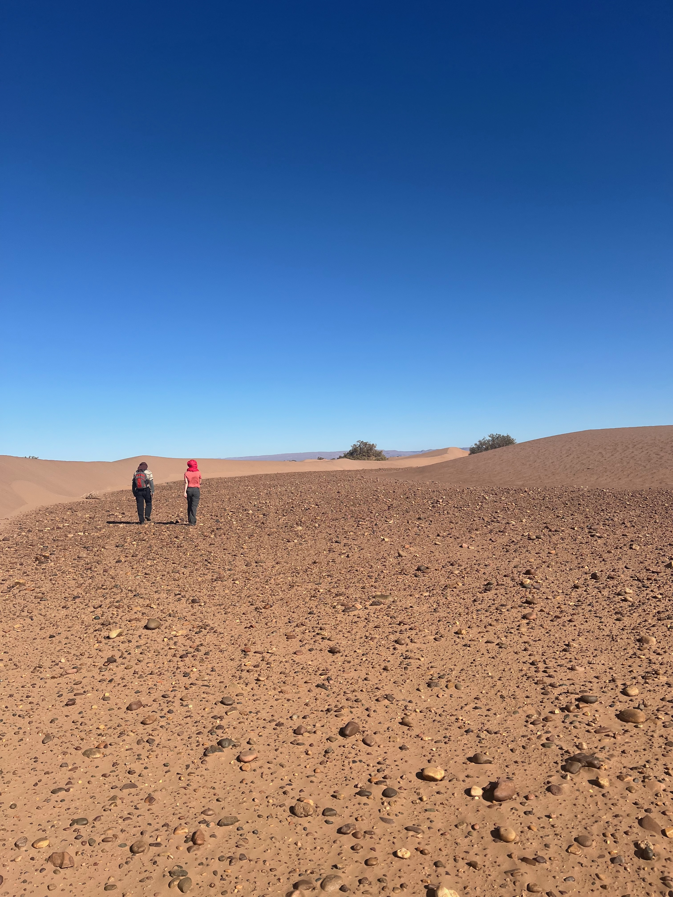
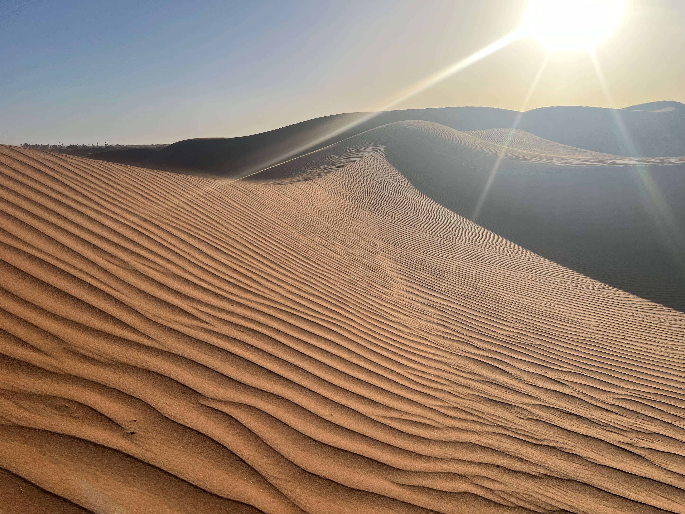
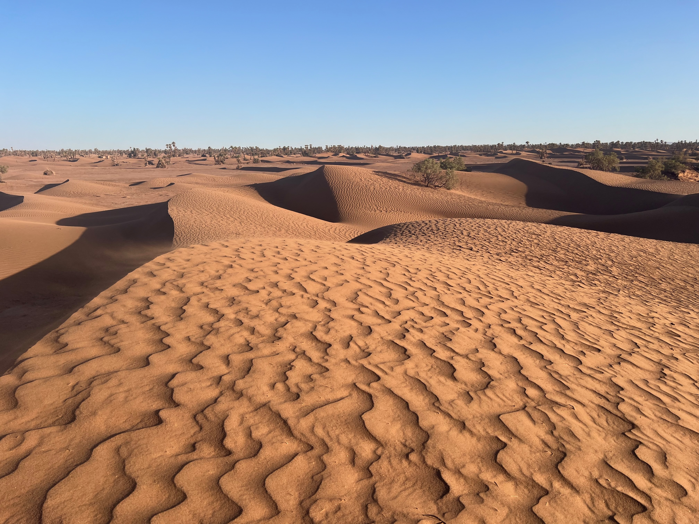
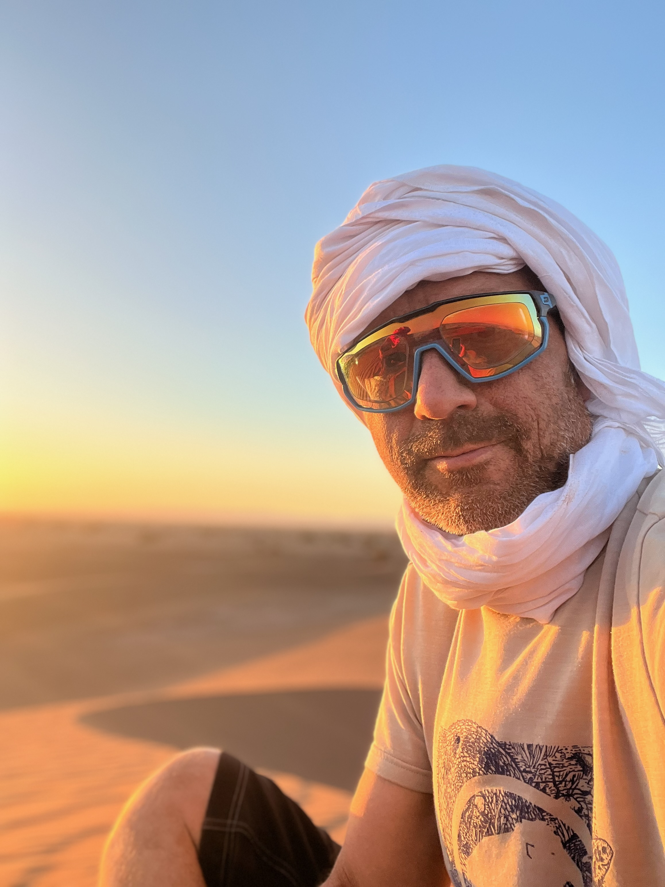

# The size of your steps

Every day we are bombarded with (depressing) news and (alarming) media. Then we still roll-up our sleeves and plan our todo actions for the day and work hard on getting things done.  Yet at the end of your day, your todo list probably has still grown despite your closed actions. Your stress level probably as well. Sounds familiar as a stage setting (I could drag on a lot more on this)?

So as we navigate together in these waters, the question I ask myself is : am I really progressing?

<figure markdown>
{ width=60% }
</figure>

<!-- more -->

Say I am in the desert, on my way to Promised Land, returning to Egypt is not an option. My direction is clear. And yet : how can I assess my progress and feel satisfied? As nothing resembles more to a sand dune than another sand dune, am I not falling back on my path?

<insert picture from Morocco>

Now of course, some days are *special*. They might be highlights such as anniversaries or successes. They will stand-out and you could say that achieving those outcomes are real proof points of your progress. You might even get compensated for those. But those might be what (...) 10-20 days in a year? That still leaves you with ~340 days.

And while we may have our directions, work with objectives agreed professionally with management (or privately with your spouse), I started wondering what I could do myself to get a better sense of my own steps, what’s in there for me? Not so much about getting things done, but a lot more of what have I learned today and what difference did I made and how did I develop myself? How about increasing the cadence on those.

Because it might be that you’re turning in circles, going backwards, or feel lost. Some days will feel like failures. And if this is the case, your resilience might be at stake when your next hurdle or challenge shows up. Your energy is getting drowned, step-by-step.

Human Resources are quite conscious of this. I have seen good initiatives all aiming at strengthening the feedback given to employees, increasing the cadence of exchanges, developing communities, synergies. Improving the quality time. But do you really aspire to let your work experience define your personal development? You cannot always rely on others to motivate you (leaders, managers). It might help, but will unlikely be fulfilling.

Another option are social networks. You may chase likes on LinkedIn or Strava or Instagram. And the more likes you get, the more rewarded you feel. But again, whilst the feedback from others matters, is this defining your own steps and your progress? I leave the question open as being personal, but in my case, it does not.

So I decided to start an experiment. I chose to write down my learnings. I started *journaling* them. Publicly and in all transparency. And each of my posts shall describe the size of the steps I leave behind me in the sand... am curious what my pathway will look like !

<figure markdown>

{ width=60% }

{ width=60% }

{ width=60% }

</figure>