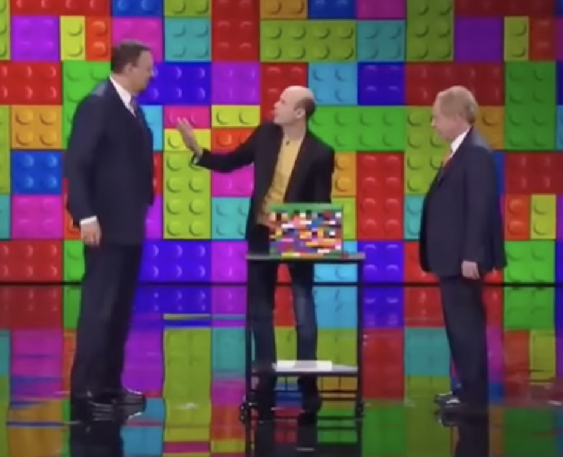

# 7 seconds

Active listening, empathetic speech, the first 7 seconds, uncertainty reduction theory: a quick internet search triggered numerous content about effective communication in the first moments of a discussion.

And I often ask myself how to improve my communication when I address an audience or a person.

The topic matters to me because during my recent bike trip, I learnt that encounters could be such intense highlights. Loaded with empathy and amazingly spontaneous camaraderie. This made me wonder how to keep the experience in a much wider context. And not limited to a 40 day solo trip on a bike to cross the United States southbound.

<figure markdown>
{ width=60% }
</figure>

<!-- more -->

So what can I do to strengthen those first moments? Noting that I am rather inclined towards being an introvert, quite rational with limited charisma.

1. **Connect** to my audience ; the first moments, non-verbal communication is there. So you should have an honest stance, self-awareness that signals trust. And also have high consideration for your audience.
2. The **mirroring** effect : in your opening and on your key messages, the audience will - consciously or not - imagine how your message applies to themselves. This will either distance them (they don't feel relevance) or raise their interest (they are able to identify themselves to your saying).
3. Be **aware** of your intended relationship / role play : are you a teacher or the expert (you have knowledge they don't have), are you a manager (you decide they execute), are you a friend (you are there to help them), are you a resource (they want something from you), are you a father (you want to protect them). A simple way to handle this could also be the "triangle" of the good, the bad, the victim. 
4. Chose a **Drumbeat** : avoid by all means a long monotonous speech. Inject tone, colour, silence, antagonisms, open questions. You can actually also cycle repetitively across the above points. And make use of the 5 "C" in your approach as you do it (Courage, Curiosity, Creativity, Confidence, Collaboration) which are great ways to share and connect emotionally with others.
5. Be **prepared** : all situations are not alike. It's not one truth for all situations. So I think it is a good practice to step back and establish those points above, have your defined opinions and stance sort of organised. And also reflect in hindsight if it worked (but it's good if you diverge!). Don't hesitate to experiment.

If you want to feel inspired by great communicators, look-up a speech of Martin Luther King or have fun with Jandro or Dani Daortiz when they do their magic trick at Penn&Teller's. If we could just use a tiny bit of their skills in our day-to-day communication - wouldn't that be fantastic ;^) (noting that this required lot's of practice and rehearsing...)

=== "Jandro's magic with a smile"

    

    	<iframe src="https://www.youtube.com/embed/SyX9w05JHuQ?si=RUpRWK5C8I4z5_fV" frameborder="0" allowfullscreen style="position:absolute;top:0;left:0;width:100%;height:100%;"></iframe>
    	

=== "MLK speech : what's your life blueprint?"

    Six months before he was assassinated, Martin Luther King [spoke](post2/post2_MLK_blueprint.pdf) to a group of students at Barratt Junior High School in Philadelphia on October 26, 1967.
    

    	<iframe src="https://www.youtube.com/embed/ZmtOGXreTOU?si=FaUnt6oMTdRahSgi" frameborder="0" allowfullscreen style="position:absolute;top:0;left:0;width:100%;height:100%;"></iframe>
    	

=== "Dani has an amazing card trick"

    

    	<iframe src="https://www.youtube.com/embed/5_KcQt0z-eE?si=UI_0DMP6TJ9M2b7T" frameborder="0" allowfullscreen style="position:absolute;top:0;left:0;width:100%;height:100%;"></iframe>
    	

