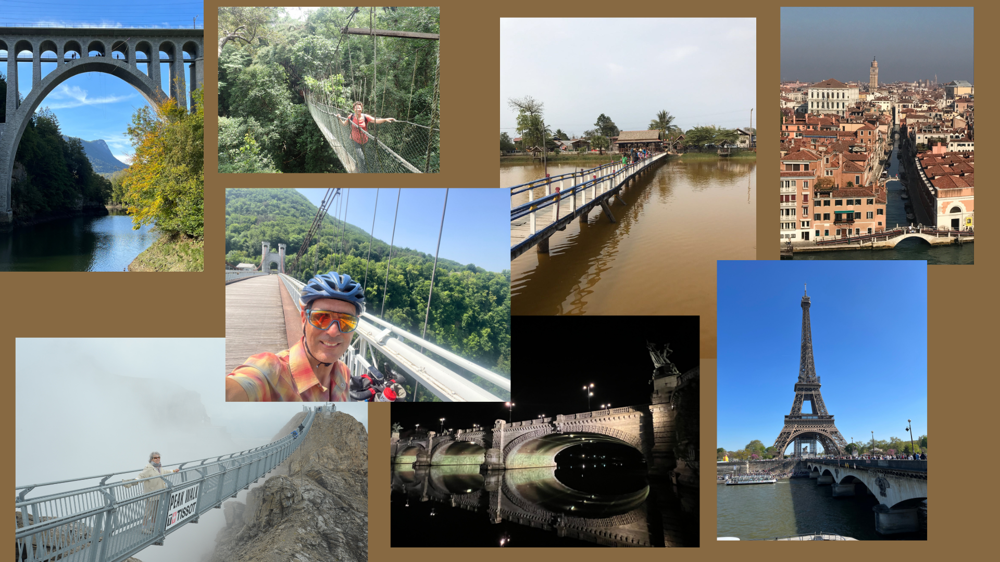

# Ethical Leadership & building bridges

I updated my LinkedIn profile with “Ethical Leader” next to being a transformation architect, but what’s implied with this choice of terminology and how does it sound forward-looking?

Well, in a world of daily uncertainties echoed as —*geopolitical tensions, nationalist movements, technological disruption, and climate change*— I wanted to shift my views about society and the actions I take. 

Driving by “ethics” might actually sound outdated or tied to rigid traditions. However, ethical leadership today is about much more than clinging to the past; it’s about inspiring positive change, trust, and innovation in an unsettled world. And I think building bridges are a nice illustration of architecting change with such ethics in mind.

<figure markdown>
{ width=60% }
</figure>

<!-- more -->

Here’s how ethical leadership can articulate a fresh, visionary, energizing force.

!!! success "Ethical leadership as a catalyst for innovation and progress"
By placing people above profits and making decisions transparently and fairly, ethical leaders foster trust, psychological safety, and a culture where diverse perspectives and creative ideas can thrive. This environment accelerates innovation —even “bootlegging” or grassroots innovation among employees— because people feel empowered to take responsible risks and think boldly.

!!! success "Modern ethical leadership rooted in openness—not dogma." 
The best leaders today don’t have all the answers. They are curious, adaptable, and eager to learn from others. Open-minded ethical leaders nurture inclusivity, listen actively, embrace new approaches (including AI and digital transformation), and build cultures where experimentation is encouraged and failure is seen as an opportunity to grow. This is the opposite of being close-minded or stuck in the past.

!!! success "Ethical leadership is inseparable from resilience and long-term success." 
In turbulent times, trust and credibility are critical. Ethical leaders stand as beacons of integrity, guiding teams and organizations through uncertainty by remaining true to a core set of values—compassion, fairness, accountability, and transparency. This stabilizes teams and enables organizations not only to survive crises, but to build sustainable future success.

!!! success "Ethics for a changing world." 
When the ground shifts rapidly, ethical leadership ensures that change benefits not just organizations but also communities and society. It turns progress—from global trade shifts to AI—into something inclusive, responsible, and empowering, rather than divisive or exploitative. Ethical leaders ask, “How can this change improve lives for all and serve the greater good?”.

Finally here are the 5Cs that trigger my enthusiasm and help me build such valuable bridges : 

!!! note ""
    - Inspire with **C**onfidence, 
    - Lead with **C**ourage,
    - Drive by **C**ommitment, 
    - Innovate with **C**reativity
    - Unite with **C**ollaboration.

