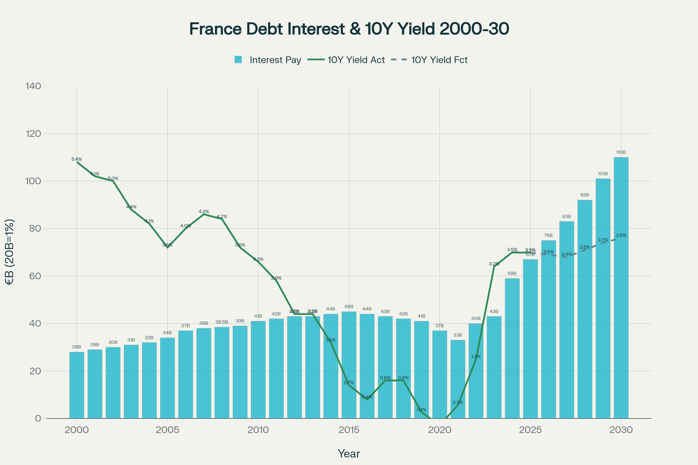
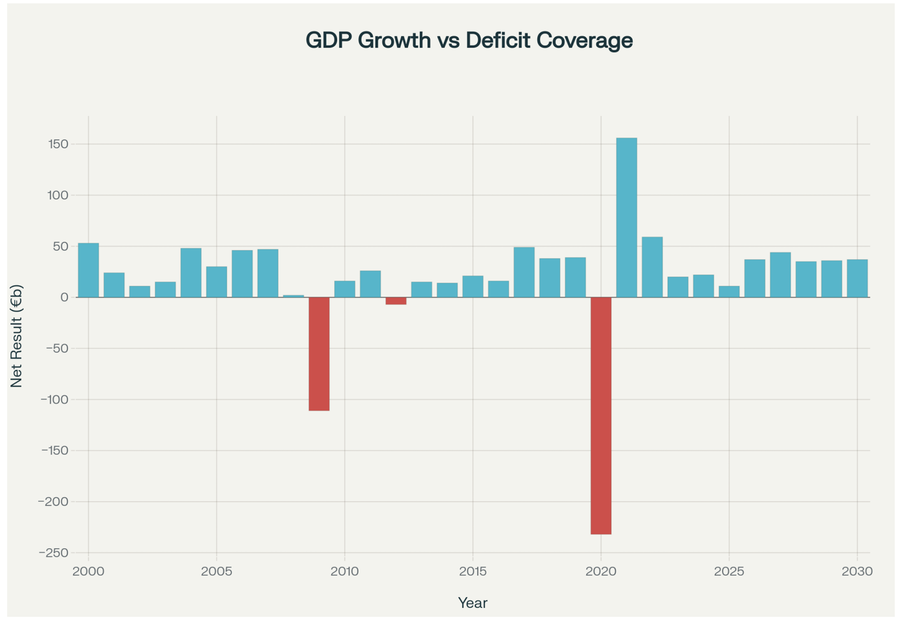
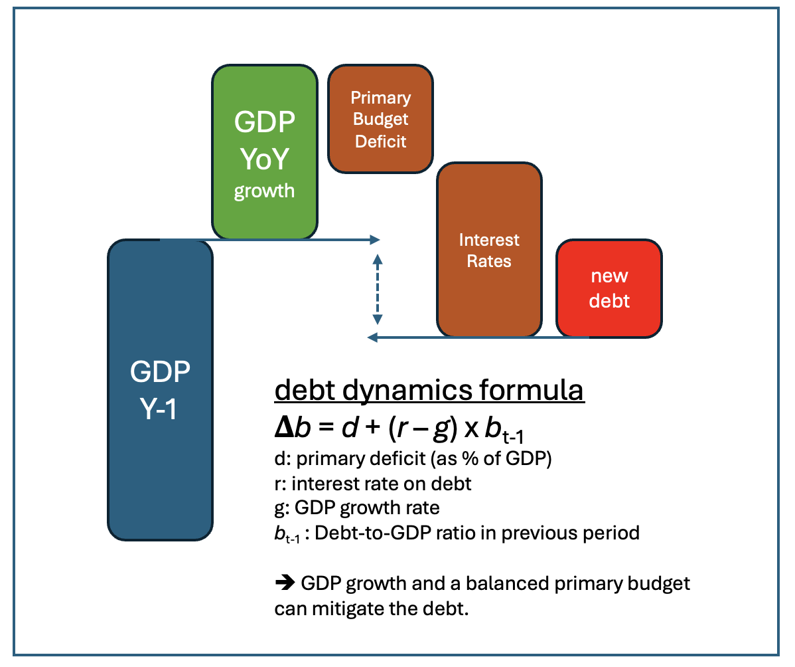
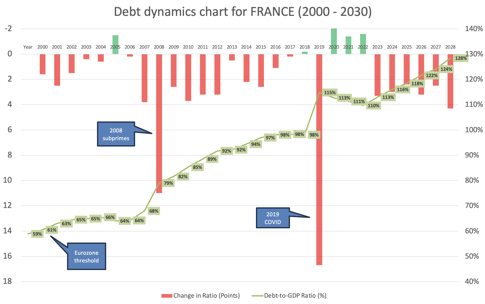

# Shifting gears

Last week has been an eye-opener for me as I watched the speeches at the french Parliament. I was trying to make sense of the statements issued by the departing prime minister François Bayrou.

In a nutshell, he was claiming that France was put into the corner or nearing the cliffs, as the debt financing was only going to grow (above €100B by 2030) while France nation was able to create net resource of €50B. What was the meaning of these numbers and why such a drama with a downwards spiral for France legacy and future generations?. I started to go into fact checking mode and with the help of some AI (Perplexity), refreshed basic economic terms. This post outlines those resulting key aspects.

!!! warning "post written with research and charting through AI Perplexity"
    While the AI Perplexity was researching source date from the web (Statista, https://tradingeconomics.com , ECB and Banque de France), I have not verified detailed numbers. But the groundwork is useful if you want to understand what's driving a state budget situation at national level. Then again, I did struggle a bit to get the charts and graphs perfect and typically resolved to export and finalise in Excel myself.

<figure markdown>
{ width=50% }
<figcaption> Should we not seriously envisage shifting gears downwards?</figcaption>
</figure>

<!-- more -->

So I wanted to a) understand the issue and b) run some fact checking against it. After doing some research and rework somewhat my basics in economics, I understood that :

France does have a national budget with a deficit. In itself not uncommon. But :

- France also has **a significant debt** : currently close to 120% of its annual GDP (Gross). As a means to compare, the rule in Eurozone is to limit it at 60% (which Germany for instance does). Accordingly, France belongs to the most indebted countries (thinking of Italy, Japan and USA here).
- The **financing** of the debt, which is a key responsibility of any government is under pressure. The interest rates (yield) are specific to each country and best represented by the 10 year mark. But fact is those rates have increased over the last 10 years for France. We are in the range of €50B and the forecast (as new debt needs to be contracted at a higher rate and interests be paid) by 2030 is more than double.

So : budget has a significant deficit (-5% whilst the rule for Eurozone is max -3%), the debt itself is overwhelming and the debt financing will significantly grow. All ingredients for a negative downturn spiral are present.

<figure markdown>
{ width=60% }
<figcaption markdown>Favorable interest rate trends cede place to steep increase, with a plateau expected near 3.5% 10 Year yield</figcaption>
</figure>

The chart visualizes the marked downward trend in French sovereign rates from above 5% in 2000 to near zero by 2020, followed by a sharp upturn after 2020 in response to inflation and rate hikes. The period 2020–2023 sees a reversal, with yields climbing from negative territory to above 3% in 2023, reflecting changing global economic and monetary conditions.

So fine, the situation is getting tense with interest rates going up and financing as well. But most countries do have a deficit in their budgets, so why is it an issue for France?

<figure markdown>
{ width=60% }
<figcaption markdown>How France GDP YoY growth compensates primary budget balance (ie. before paying debt interest rates).  </figcaption>
</figure>

As the chart illustrates, GDP annual growth  coverage of primary budget balance (so the balance of budget before the pay-out of all due debt interests) is hardly above the 50B€ mark as François Bayrou mentioned. Whilst the debt financing (so the amount to pay to sovereign obligations subscribers ) is seen to increase above 100B€ due to the interest rates increasing. This leads to a net decrease in value for the nation : you're consuming more than you're able to produce in value.

<figure markdown>
{ width=50% }
<figcaption markdown> A simple explanation of debt dynamics. </figcaption>
</figure>

But the combined effect of all those dynamics and trends is shown in this last chart. Here you can really see the actuals of the debt-to-GDP ratio (increasing linear graph in %) as well as the year-on-year variation  (red bars signal a year-on-year declining ratio measured in points of %).

<figure markdown>
{ width=60% }
<figcaption markdown> The increasing Debt-to-GDP graph is really worrying, starting at 60% to aim at 120% by 2030, </figcaption>
</figure>

Indeed the combination of a) GDP limited growth coverage and b) interest rate increase drives  yield  and debt  inflation, deteriorating the debt-to-GDP ratio consistently (between 3 and 4 points, see red bars).  Resulting total debt increases faster than GDP. 2030 outlook shows debt interests >100B€, and debt-to-GDP ratio >120% (vs. Eurozone target of 60%). A strong fiscal stress for the 7th global and 2nd Eurozone economy by nominal GDP.

## Drawing some first conclusions

Well, there's probably more to say in a few more posts. My current assessment is that the situation is indeed serious and that France politicians should definitely also embrace a longer term outlook in terms of policy. The place of the 2nd Eurozone nation by nominal size is not exactly pretty. We need strong enconomists in France !

Then again, everything gets compared to the size of an annual GDP - which is what the country is able to generate in value - within a year. This is big, but then again, it is *only* a one year measure. France is a large and resourceful country.

And as I will dig into in a few other posts, France also has very strong positions. First of all, its social system (whilst a limiting factor in terms of reform flexibility) and strong large administration, allows for a good redistribution of national goods and protects the low revenue segments. Furthermore, in case of ponctual crisis (subprimes and COVID), this system demonstrated a good resilience.

Conversely, one should not ignore the high debt, the high taxes on enterprises, the difficulty to drive future-proof reforms, the reducing purchasing power. Clearly, France does not withstand well the comparison with other European key countries.

So : one can only hope that vision, peace but also a lucid reality check will drive gear shifting to find the appropriate pace 🙏.

How about other countries ? Well I invite you to look at your own country's situation. On my side, I did also check Germany, USA, Switzerland and am trying to create a simple dashboard to keep up. I do suspect this is wise practice given times ahead.

