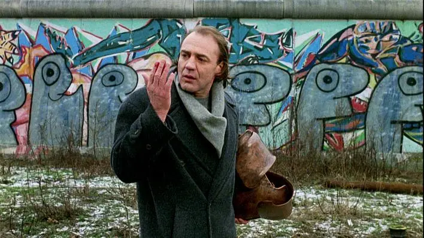

# Welcome to my personal blog space

I decided after my Great Divide Mountain Bike Route [adventure](https://divide.siroccomeister.net) to continue writing. So I set-up this new online space to just do that. 

A couple of inspirations that I combined to incept this:

- In the chinese/japanese game of GO, there's a figure called [atari](https://en.wikipedia.org/wiki/List_of_Go_terms#Atari) which implies a call for action to remain alive. It basically yields into a [ladder](https://en.wikipedia.org/wiki/Ladder_(Go)) that you keep building or climbing or (...) breaking. I like the momentum that is implied and find it inspiring in a world that tends to ignore itself. I aim at progressing on my ladder and break it open with increased feedom. How about you?
- [*Faraway, So Close!*](https://en.wikipedia.org/wiki/Faraway,_So_Close!) is another quote from a Wim Wenders movie. The sequel to famous *Wings of Desire*. While some of our concerns and hopes may seem far away, life is an opportunity we can seize now to make a difference. And it nurtures our curiosity and envy to explore.

<figure markdown>
{ width="500px" }
<figcaption markdown>© Wim Wenders / Argos Films </figcaption>
</figure>
