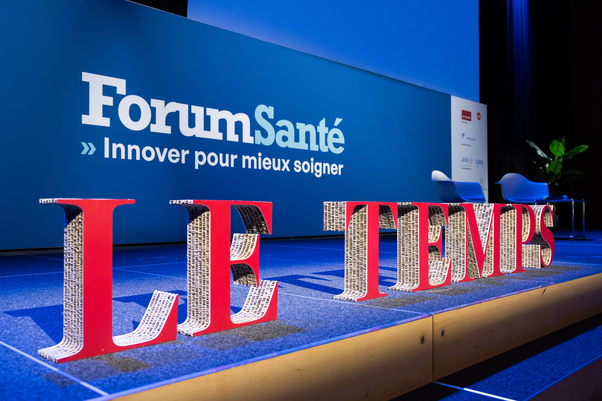
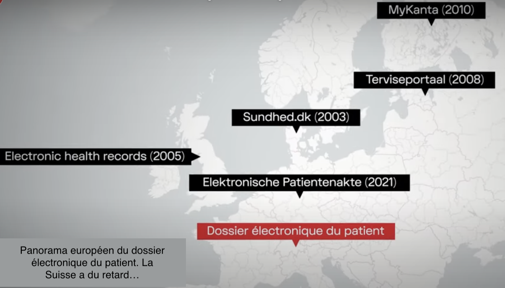
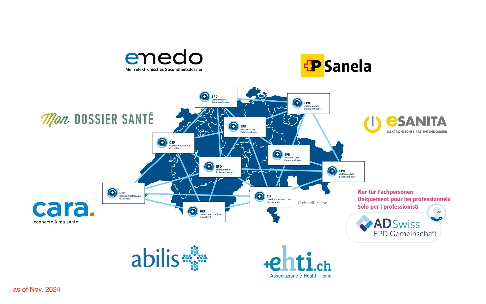
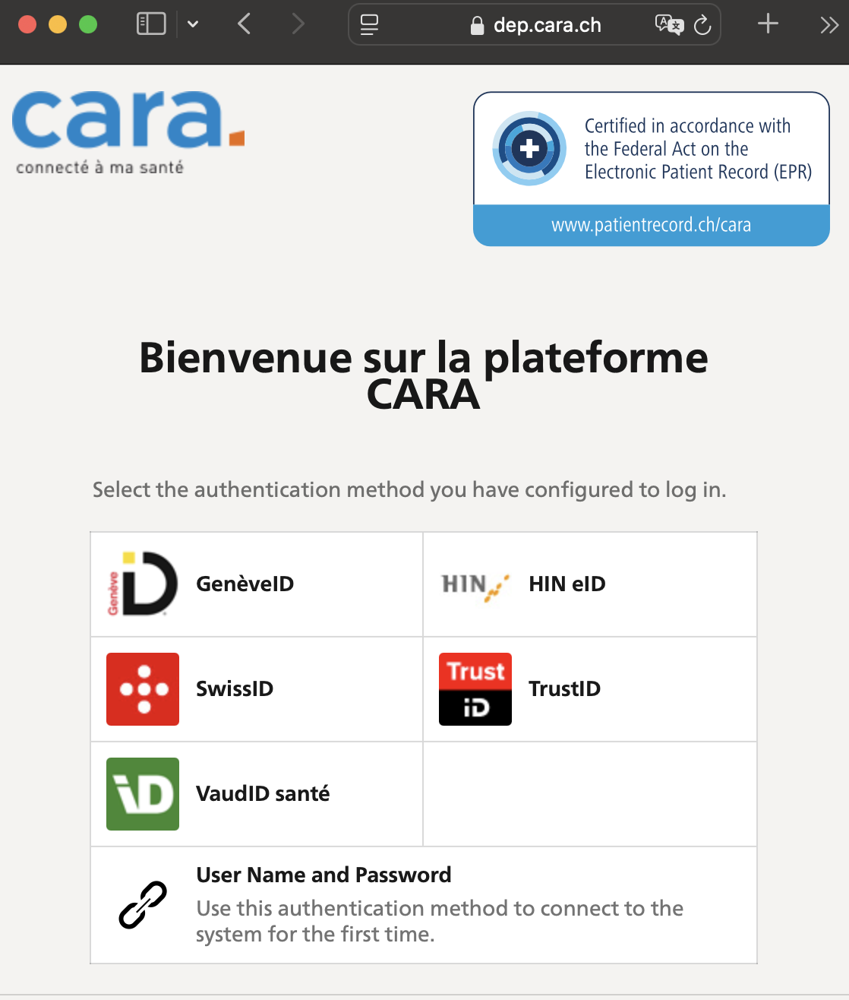
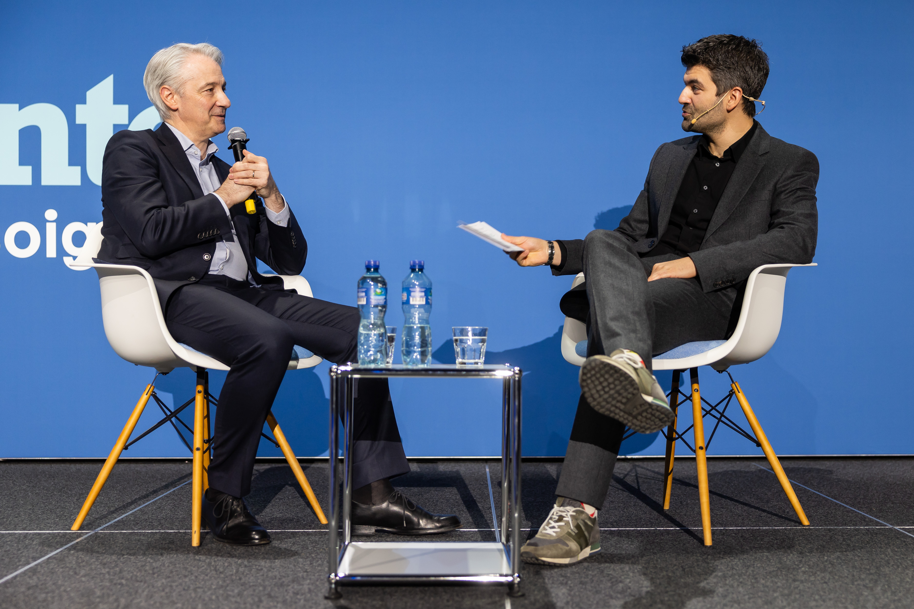

# Retour sur le Forum Santé 2024

Ca y est! Aujourd’hui j’ai crée mon dossier électronique du patient (DEP) ou encore Elektronisches Patientendossier (EPD). J’y ai été sensibilisé en participant à la 7ème édition du Forum Santé 2024, un évènement [Le Temps](https://events.letemps.ch/sante). Les sujets qui m’ont marqué et que j’aimerais développer dans ce post et probablement creuser ultérieurement sont multiples :

- le retard de la Suisse dans la digitalisation du système de santé
- le dossier électronique du patient : quelle réalité
- les réseaux intégrés - une vraie bonne idée?
- une logistique renouvelée pour une médecine de précision
- les promesses de l’ARN messager
- les promesses de l’IA
- retour à la réalité : merci René Prêtre &nbsp; :octicons-heart-fill-24:{ .heart }

<figure markdown>

{ width=60% }
</figure>

<!-- more -->

## Le retard de la Suisse

Le système de santé Suisse parait bien en retard dans le paysage digitalisé européen. L'introduction du forum a fait référence à une [étude McKinsey de 2019](https://www.mckinsey.com/ch/~/media/mckinsey/locations/europe%20and%20middle%20east/switzerland/our%20insights/digitization%20in%20healthcare/digitization%20in%20healthcare%20%20the%20chf%2082%20billion%20opportunity%20for%20switzerland%20en.pdf) qui évoquait une opportunité de CHF 8.2M d'économies via la digitalization dans le système de santé Suisse (soit 10% des coûts). Le leader incontesté en Europe est [l’Estonie](https://www.mind.eu.com/health/essentiels/fiche-pays-estonie-les-atouts-du-champion-europeen-du-numerique/) (1), qui a pris un virage fort à sa sortie de l’URSS. Le digital aide à combler le manque de personnel médical (une réalité qui va devenir de plus en plus marquante en Suisse). En plus de l’efficacité, l’Estonie vise de passer d’une “médecine pour tous” à une “médecine pour chacun”. Une manière paraphrasée d’ambitionner une médecine dite de **précision.**(2)
{ .annotate }

1.  :light_bulb: l’Estonie a 1.5M d’habitants pour 45’000km2 (superficie comparable à la Suisse). Elle a rejoint l’union européenne et l’OTAN en 2004. Sa population est apparentée aux Finlandais.

    La résilience de l'État estonien et de son économie est attribuée entre autres à la **digitalisation de l'administration et des services publics** effectuée au sortir de l'occupation (URSS), au point que le pays est régulièrement qualifié d'État plateforme. Cette stratégie, conjuguée à une politique plus libérale que ses voisins nordiques, permet à l'Estonie de bien figurer au classement de facilité de faire des affaires et d'avoir le plus grand nombre de start-ups par habitants en Europe ([Wikipedia](https://fr.wikipedia.org/wiki/Estonie)).
    
2.  Selon les sens que les médecins veulent mettre en avant, cette médecine est aussi appelée médecine personnalisée, médecine stratifiée, médecine 4P (prédictive, préventive, personnalisée et participative). ([Wikipedia](https://fr.wikipedia.org/wiki/Médecine_personnalisée))

Les pays leader en Europe se déclinent ainsi : l’Estonie est la plus avancée. Tous les habitants ont un dossier électronique (Terviseportaal depuis 2008) qui a la particularité d’échanger des données avec la Finlande (MyKanta depuis 2010). Le Danemark a un portal de mise en relation avec les professionnels de la santé depuis 2003. Les Allemands ont rattrapé leur retard en 2021. Toutes ces recettes reposent sur :

- une gouvernance digitale centralisée 
- une priorité exprimée à l’échelle nationale
- la confiance des citoyens dans des services digitaux

=== "Panorama Europe"

    

=== "Reportage Le Temps"

    

    <iframe src="https://www.youtube.com/embed/SNDMbFFkOeY?si=Irlevetwd-yX9Pe6" frameborder="0" allowfullscreen style="position:absolute;top:0;left:0;width:100%;height:100%;"></iframe>
    

    
## Le dossier électronique

Quelle réalité pour le dossier électronique du patient (DEP). Décryptage et aspects pratiques.

### Tour d'horizon et décryptage

Quelques points clés :

- Une loi fédérale ([LDEP](https://www.bag.admin.ch/bag/fr/home/gesetze-und-bewilligungen/gesetzgebung/gesetzgebung-mensch-gesundheit/gesetzgebung-elektronisches-patientendossier.html))  administrée par l'Office Fédéral de la Santé Publique (OFSP) et entrée en vigueur en avril 2017
- Un centre de compétence et de coordination [eHealth](https://www.e-health-suisse.ch/fr) avec les cantons à l'échelon fédéral
- Un dossier électronique qui repose sur :

	- une [identité électronique](https://www.e-health-suisse.ch/fr/coordination/le-dossier-electronique-du-patient/identites-electroniques) qui utilise une authentification fiable dite "forte". La Poste opère ainsi [SwissID](https://www.swissid.ch/fr/einloggen/epd.html) alors que Genève et Vaud ont développé leur propre solution.
	- une communauté de référence (1) qui stocke les données en respectant le bon format d'échange (sur un ou plusieurs cantons).
	

1.  

!!! Note "Révisions de la loi LDEP"
	Annuellement, l'OFSP et eHealth oeuvrent pour [actualiser](https://www.bag.admin.ch/bag/fr/home/gesetze-und-bewilligungen/gesetzgebung/gesetzgebung-mensch-gesundheit/gesetzgebung-elektronisches-patientendossier.html) la loi.
	Le conseil fédéral se penche ainsi sur la question du financement et vise à revoir le modèle de décentralisation. Le 27.9.2024, la décision de principe que l’infrastructure technique du DEP devra être mise à disposition de manière centralisée est prise par la Confédération. Un financement transitoire est aussi adopté par le parlement (octobre 2024). En résumé on doit s'attendre à :
	
	- Un eID étatique pour tous
	- Un DEP automatique et gratuit par défaut (système "opt-out")
	- Une utilisation obligatoire par tous les acteurs (usage étendu à tous les acteurs de l'ambulatoire en plus des hôpitaux : médecins, pharmacies, physiothérapeutes)
	

### Mise en pratique

Je me suis lancé : en combien de temps arriverai-je à m'installer un dossier électronique? Franchement c'est assez simple comme démarche. Résidant dans le canton de Vaud, [j'ai suivi les étapes](https://www.cara.ch/fr/Wizard/Vaud-soi-meme.html) après une recherche rapide sur internet.

!!! note annotate ""
    === "étape 1 - eID"
        - Il s'agit de crée une authentification forte. J'ai téléchargé l'application [VaudID-santé](https://register.sante.vaudid.ch/md/vaudid) sur mon smartphone. A partir de là, il faut suivre les étapes classiques. 
        - L'identification est sérieuse, y compris avec un appel video dans lequel il faut présenter une carte d'identité ou équivalent. Une photo portrait est prise. En principe il faut prendre RDV mais au final, j'ai pu initier un appel spontanément. 
        - A partir de là, il y a quelques minutes de délais puis l'eID a été confirmée. En tout (si j'exclus le délai pour prendre un RDV), je m'en sors en 20mn
    === "étape 2 - CARA"
        - Il faut ensuite lier mon eID avec un dossier électronique chez l'une des communautés de référence.
        - Dans le cas de Vaud, c'est [CARA](https://forms.cara.ch/patient-consent). Là aussi, la démarche est simple et automatique.
        - Une fois le dossier crée, on peut sélectionner les établissements hospitaliers et les praticiens référencés afin que les documents soient transmis et consolidés. Par cette étape, j'octroie accès à mon dossier, à mes documents.
    === "étape 3 - accès"
        - Il me suffit de passer par la [page de connexion](https://dep.cara.ch) (1).
        - Après une semaine, j'ai pu constater qu'un dizaine de documents (allant de tests COVID à des analyses suite à une chute sur la main) avaient apparus dans mon dossier DEP. Cela fonctionne donc (même si les documents ne reflêtent que partiellement mon parcours médical récent). Cela reste une expérience positive. Les documents sont stockés en vrac mais peuvent être filtrés.
1.      

En conclusion : cela fonctionne, est accessible si on a l'habitude d'un parcours digital. Je comprends aussi la nécessité de passer par un guichet pour profiter d'une aide bienveillante pour ceux qui n'ont pas l'habitude. Pour le moment, j'entrevois un usage encore limité car les données dans le DEP ne sont que peu structurés. Elles sont stockées en vrac et bien qu'il y ait un filtre (plage temporelle, type de document), il manque des objets structurés tels que carnets de vaccination, ordonnances. A voir aussi si les radios et scans/échographies seront accessibles. 

Un point que je trouve compliqué : pour ajouter ou donner accès à un professionel ou un hôpital/clinique, il faut le rechercher dans le catalogue (pas très futé) et aussi limiter l'accès dans le temps. Cela semble un peu fastidieux. Le gain en efficacité est encore dans le futur...

## Les réseaux intégrés

Le modèle Suisse ne rend pas les choses simples pour une digitalisation à marche forcée. Il y a une quarantaine d'assureurs et 26 cantons, donc 26 systèmes de santé différents constituant une fédération. Les professionnels doivent faire avec ce tissu très fragmenté ce qui rend une approche intégrée pour un parcours du patient unifié une réalité éloignée à ce jour. En clair : les échanges entre praticiens sont encore très limités.

C'est dans ce contexte que de nouvelles initiatives émergent. Fabrice Zumbrunnen (1) était ainsi convié pour parler de VIVA.
{ .annotate }

1.   :light_bulb: Ancient grand patron de la Migros, Fabrice Zumbrunnen est depuis le 1. Mai 2024 le CEO du groupe hôtelier et cliniques privées [AEVIS VICTORIA](https://www.aevis.com/fr/). Le groupe détient en particulier 80% de parts dans [Swiss Medical Network](https://www.swissmedical.net/fr) (un réseau de 21 cliniques et hôpitaux, 30 centres médicaux, 9 centres d'urgence, un réseau de 22 centres d'ophtalmologie et des centres de compétence).

## l’ARN messager
## les promesses de l’IA
## la réalité de René Prêtre &nbsp; :octicons-heart-fill-24:{ .heart }

Quelques sources

  <iframe src="../post1/post1_81M.pdf" frameborder="0" allowfullscreen style="position:absolute;top:0;left:0;width:100%;height:100%;"></iframe>

    
<figure markdown>

{ width=60% }

{ width=60% }

</figure>