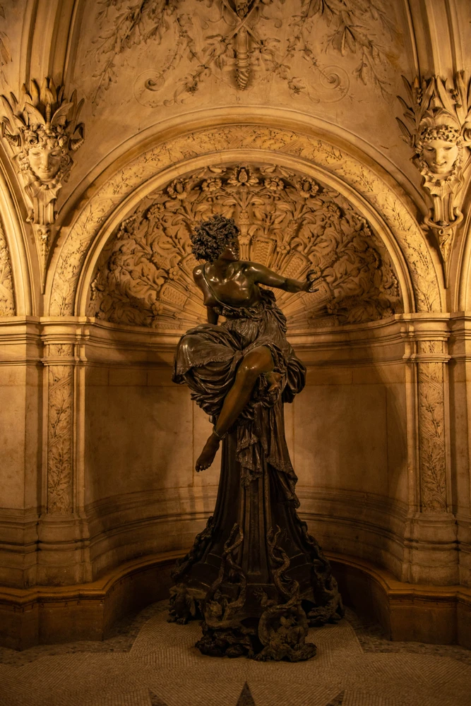
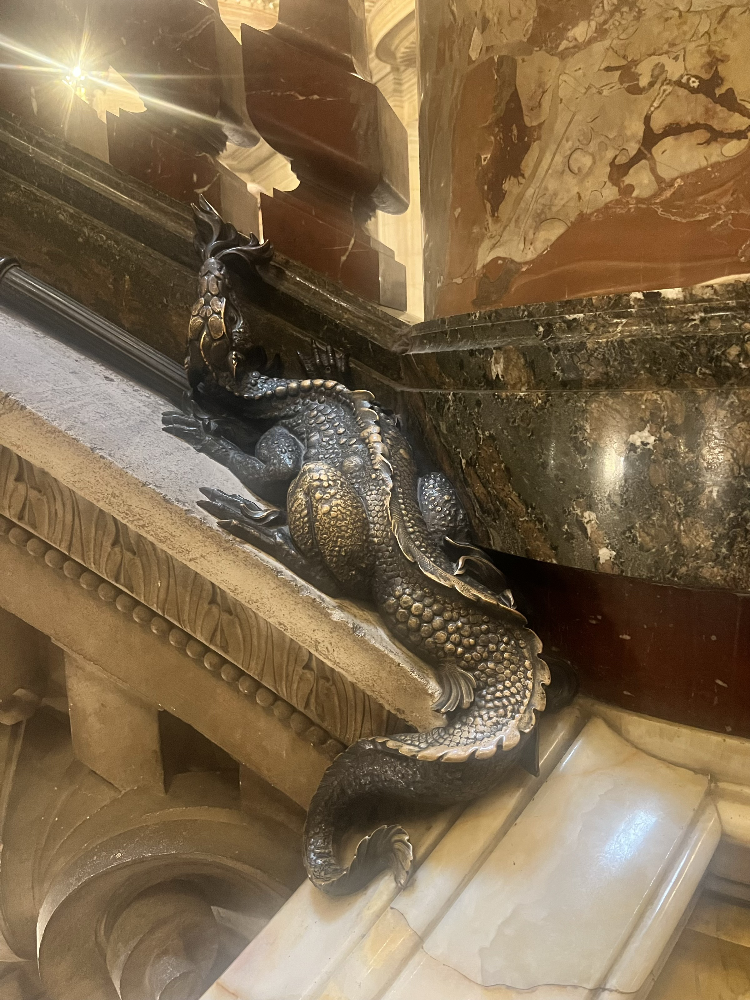
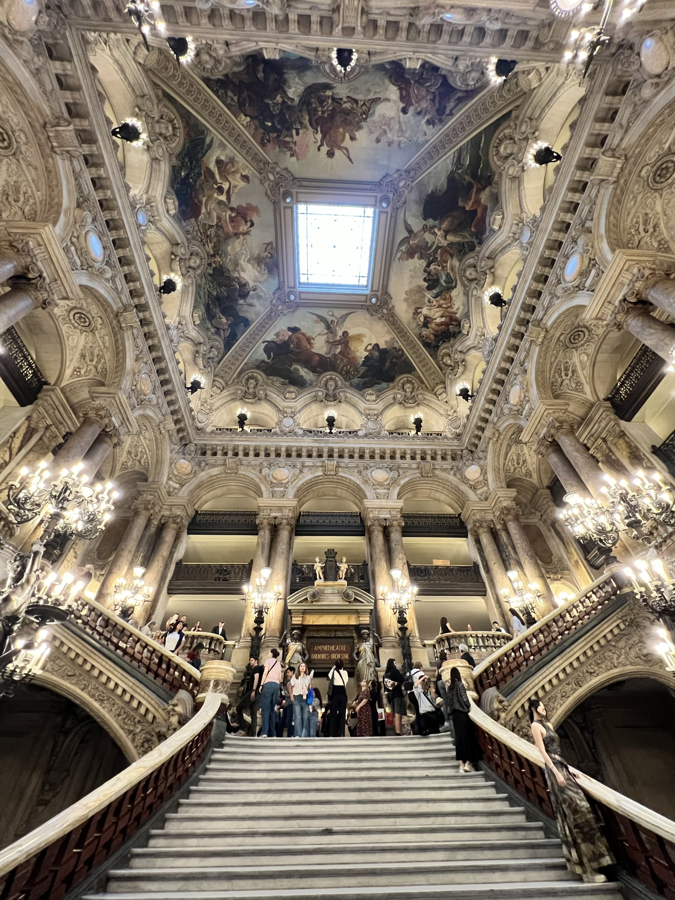
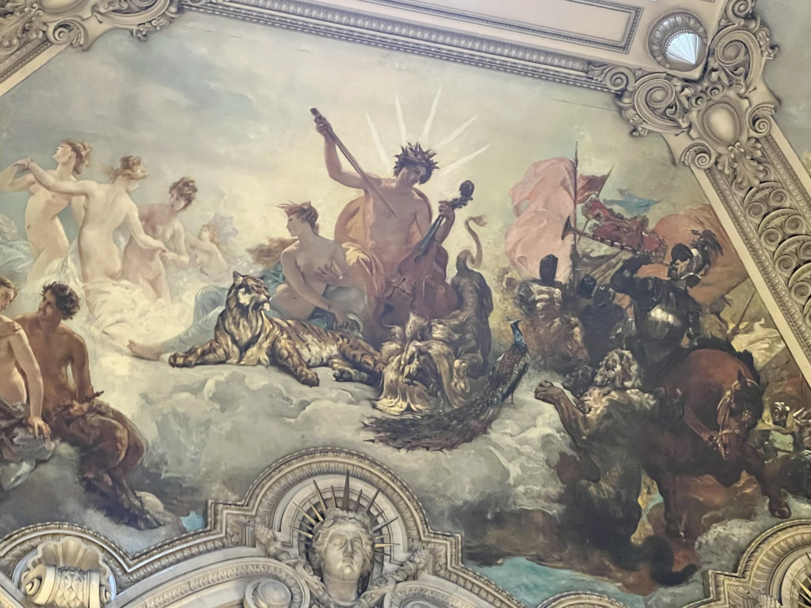
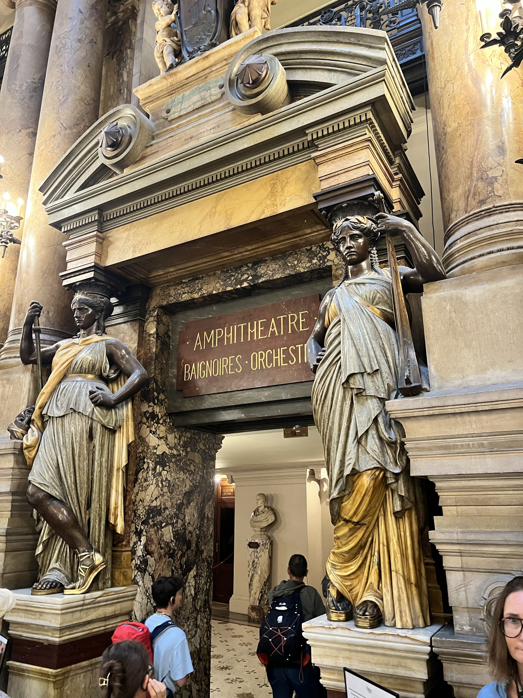
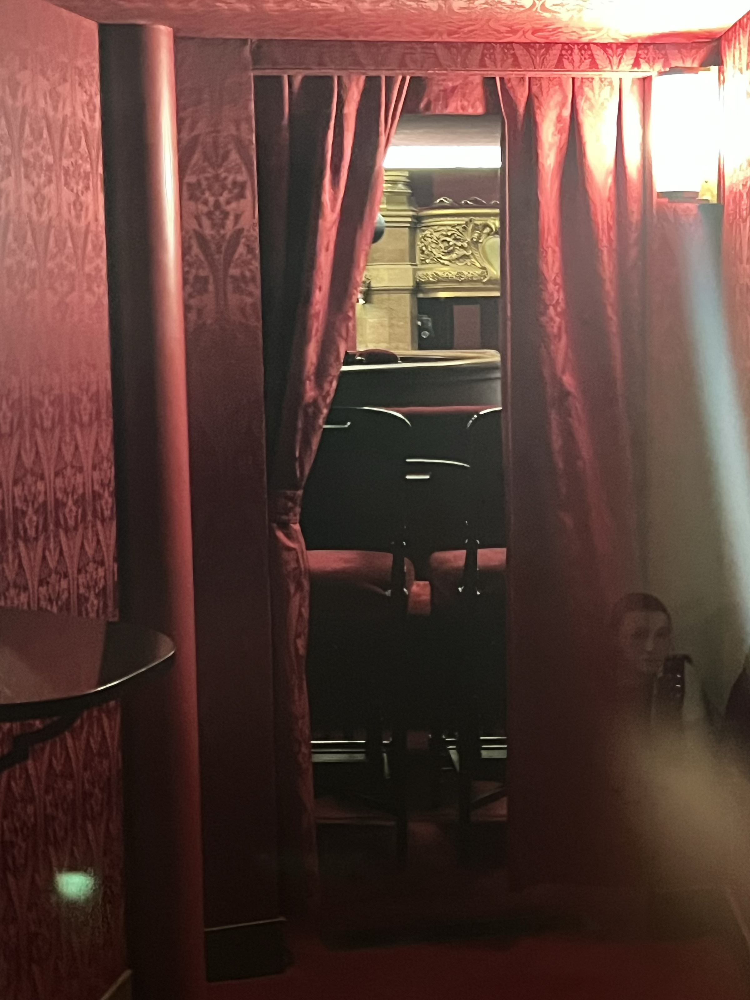
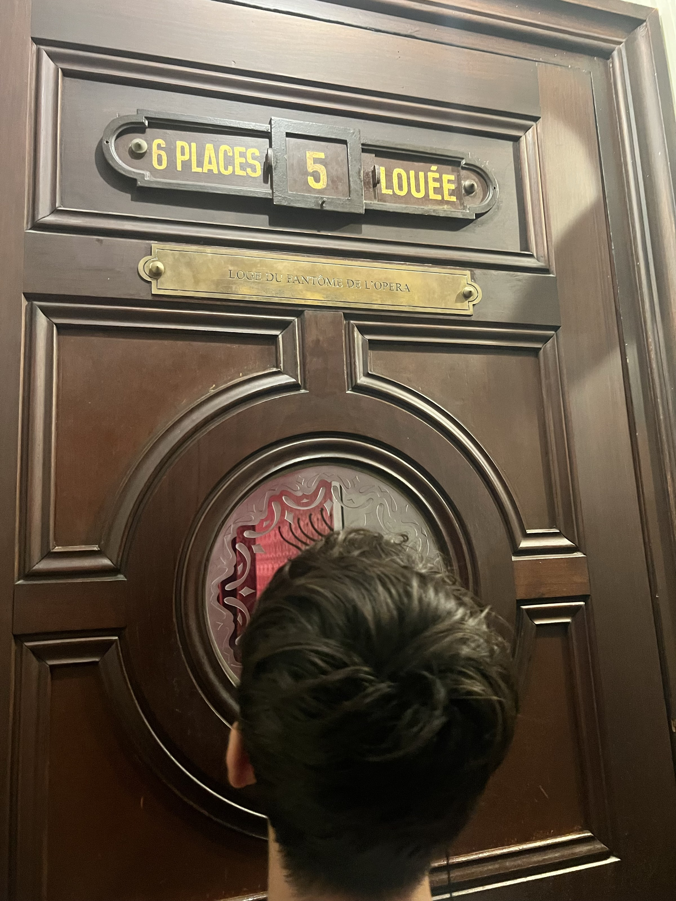
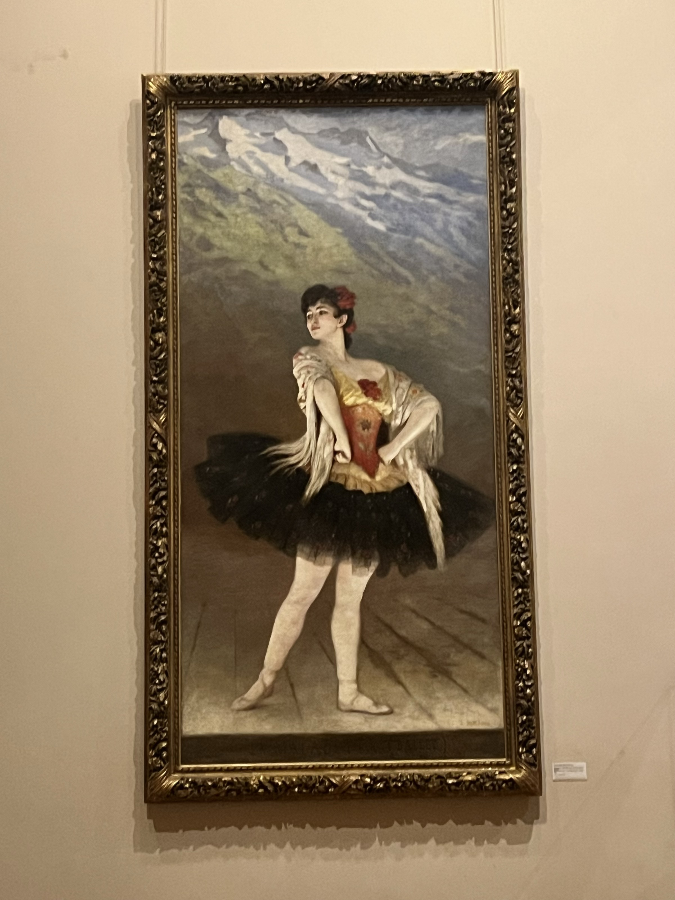
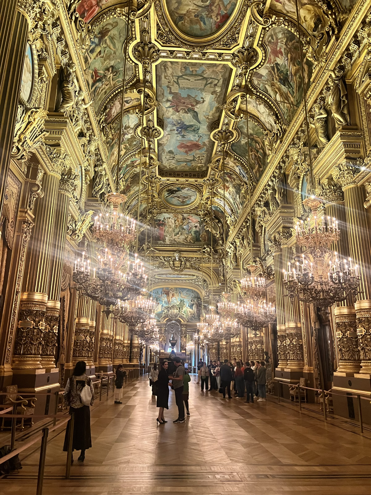
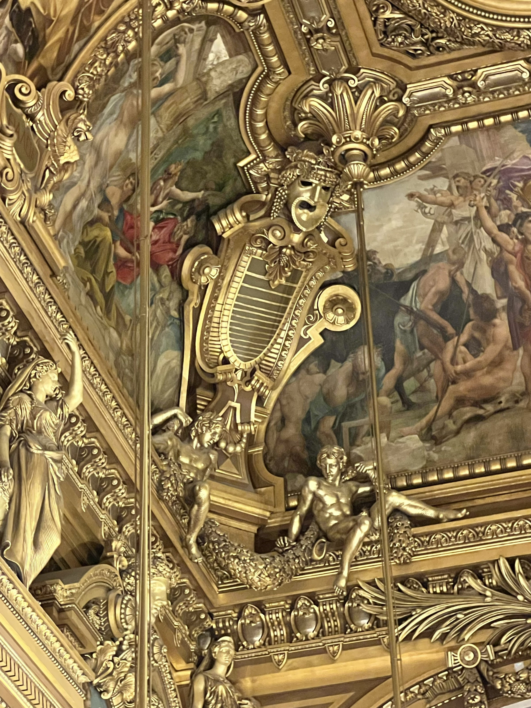

# Paris Culturel

Dans ce post je reviens sur les points forts d’un week-end prolongé à Paris, en famille, avec aussi plusieurs visites guidées. Je trouvais dommage de ne pas mettre mes notes par écrit enrichis par quelques photos. Je laisse aussi en suspens cette interrogation : la visite d’un opéra Garnier ou d’un musée tel que le Louvre illustre la grandeur d’une nation. Mais quelle inspiration peut-on en tirer dans le monde d’aujourd’hui et celui à venir?

<figure markdown>

{ width=60% }
</figure>

<!-- more -->

## Le Palais Garnier

Ce que je retiens : l’opéra a été construit sous Napoléon III à partir de 1861 par l’architecte Charles Garnier. Il aurait remporté le concours à 35 ans en  en innovant par les couleurs (nombreux marbres avec nuances et camaïeux). L’opéra a ouvert en 1875, l’empereur Napoléon III devait y prendre ses quartiers mais cela ne s’est jamais concrétisé, notamment à cause de la guerre de 1870 entraînant la chute du Second Empire. Nous fêtons donc les **150 ans** 🥳 🎂 de l'Opéra cette année 2025!

En termes de places, l’opéra dispose de près de 2’000 sièges et ensemble avec l’opéra Bastille (ouvert en 1989, architecte : Carlos Ott), cela constitue un ensemble de près de 5’000 sièges placés sous l’égide de l’Opéra National de Paris. En effet les troupes et les musiciens sont partagés sur les 2 sites. 

Quelques faits notables  à relever :

- [x] Les petits rats de l’opéra s’entrainaient dans les combles, et on entendait donc leurs “petits pas” sur les planches en bois.
- [x] L’entracte était un moment majeur, durant lequel on se retrouvait dans la galerie du Grand Foyer. Il fallait alors briller en société, que ce soit en apparence ou bien par le verbe. Un moment où la vivacité d’esprit était très demandée !
- [x] Sous la scène principale (50m de large par 30m de profondeur), une réserve d’eau est constituée (2m de hauteur) afin de pouvoir éteindre un incendie car les accidents étaient fréquents. 
- [x] La bougie ou les chandelles étaient en effet utilisés jusque vers le début 1800, cédant progressivement la place au bec de gaz dans les années 1820-30. A la fin du 19ème, c’est finalement l’électricité qui s’imposera. L’enjeu est notable avec le grand incendie de l’Opéra du Palais-Royal “salle Le Peletier” ravagé en 1873 peu avant le déménagement à l’Opéra Garnier. Ou bien encore l’incendie de l’Opéra-Comique en 1838 (60 victimes).
- [x] L’Opéra Garnier accueille aussi le personnage du fantôme de l’opéra dans le roman de Gaston Leroux. Le “lac souterrain” y fait référence à la réserve d’eau (aujourd’hui gérée par les pompiers et difficilement accessible par des échelles) et on y retrouve aussi l’incendie de la salle Le Peletier où le pianiste eu le visage brûlé.
- [x] Les loges sont des espaces privés avec des parties cachées ; des portes dérobées permettaient d’accéder à des pots de chambre en cas de “besoin”. La loge 1-3 était traditionnellement réservée à l’empereur (le plus proche de la scène, mais avec un mauvais angle!). La loge 5 est celle du “fantôme de l’opéra”. Les numéros “impair” sont à gauche, face à la scène.
- [x] La bibliothèque dispose de près de 600’000 ouvrages (livres, partitions, livrets, photographies)
- [x] Les costumes sont réalisés par les ateliers de l’opéra, souvent dessinés par des grandes maisons de couture

Malheureusement, nous n’avons pas pu accéder à la salle de spectacle car une répétition était en cours. Cela nous a empêché d’admirer le plafond, une fresque monumentale peinte par Marc Chagall qui recouvre depuis 1964 le plafond original jugé trop austère par le ministre de la culture André Malraux. L’original était circulaire et ouvert en son centre, afin de laisser s’échapper les fumées de l’énorme chandelier à becs de gaz. ☝️ D'ailleurs ce chandelier-lustre restait allumé durant les représentations! La nouvelle fresque est joliment nommée “le grand lustre du Palais” et Chagall a toujours refusé d’être rémunéré pour ce travail.

Evidemment, dans un tel lieu, les symboles sont nombreux. Apollon et le soleil sont mis à l’honneur, ainsi que toute une symbolique de la mythologie : la fontaine, le dragon/salamandre, multiples statues dont la Pythie qui nous accueille en bas de l'escalier.

Aujourd'hui, aller à l'opéra n'est plus un lieu de rencontres mais plutôt un loisir culturel. On voyage dans le temps, on fait revivre cet esprit culturel. Evidemment l'Opéra Bastille offre un cadre bien plus moderne, mais il lui manquera le charme de l'histoire et des clins d'oeils.

<figure markdown>
{ width=60% }
<figcaption markdown> La Pythie de Delphes qui prophétise sur le Dieu Apollon </figcaption>

{ width=50% }
<figcaption markdown> Dragon Salamandre le long des marches </figcaption>

{ width=50% }
<figcaption markdown> Escalier montant vers la salle de spectacle et marbres multicolores. </figcaption>

{ width=50% }
<figcaption markdown> Apollon, le soleil, les tigres dominés </figcaption>

{ width=50% }
<figcaption markdown> Accès à l'étage orchestre, statues hautes en couleurs </figcaption>

{ width=50% }
<figcaption markdown> Une aperçu de loge via la lucarne. </figcaption>

{ width=50% }
<figcaption markdown> Loge du fantôme de l'opéra 👻. </figcaption>

{ width=50% }
<figcaption markdown> Danseuse dans le vestibule de la Bibliothèque. </figcaption>

{ width=50% }
<figcaption markdown> Le Grand Foyer haut lieu de l'entracte </figcaption>

{ width=50% }
<figcaption markdown> Détail du plafond du Grand Foyer </figcaption>
</figure>