# Louvre Perspectives

Toujours en visite à Paris, nous nous plongeons dans une vision du monde multiverse. Le musée du Louvre est riche en superlatifs mais surtout héberge des trésors historiques provenant du monde entier et berce notre civilisation. 

- [x] Le plus grand des musées d'art : 10 terrains de foot!
- [x] Le plus visité : 9 à 10  millions de visiteurs par an!
- [x] Des chefs-d'oeuvre universels exposés dans un monument historique riche de 800 ans d'histoire.

Il peut sembler difficile d’embrasser l’ensemble du parcours ayant conduit à notre civilisation actuelle, souvent qualifiée de post-chrétienne en Occident.

- 	Avant Jésus-Christ, le berceau de la civilisation se situe au Proche-Orient : avec les Sumériens, Babyloniens, Égyptiens et Perses, qui transmettent leurs héritages aux cultures suivantes.
- 	L’époque gréco-romaine marque ensuite une période charnière, où la culture du bassin méditerranéen se diffuse progressivement, avant que la chrétienté ne s’impose comme référence majeure avec l’adoption du christianisme dans l’Empire romain.
- 	Le Moyen Âge voit l’émergence de l’Occident chrétien, approfondie par la christianisation progressive de l’Europe, la consolidation de nouveaux royaumes et la préservation des savoirs antiques sous différentes formes.
- 	La Renaissance, le Siècle des Lumières et les grandes révolutions politiques accélèrent le développement occidental : diffusion des droits de l’homme, de la pensée scientifique, et avènement des démocraties républicaines qui dessinent la modernité politique et sociale jusqu’à aujourd’hui.

Se promener au Louvre nous fait ainsi voyager dans le temps, nous éclaire sur d'où nous venons. A nous ensuite de faire le point et de se demander : à quoi s'attendre dans ce qui est devant nous? 🤔😉.

<figure markdown>
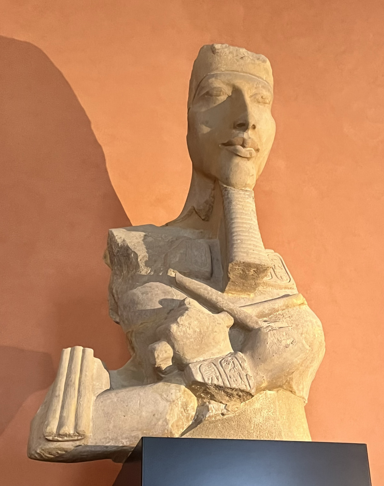{ width=60% }
<figcaption markdown> Buste d'Akhenaton  :octicons-heart-fill-16:{ .heart } : donne une impulsion révolutionnaire à la religion et à l’art égyptiens : abandon du panthéon, recentrage sur Aton dieu unique, et affirmation d’une esthétique “différente”. </figcaption>
</figure>

Contexte et histoire : il date d’environ 1352-1335 av. J.-C. sous le règne d’Aménophis IV, qui prend le nom d’Akhenaton (« qui est utile à Aton ») lorsqu’il impose le culte exclusif du dieu solaire Aton. Ce buste provient du temple d’Aton à Karnak (Thèbes), où Akhenaton avait érigé une série de statues colossales pour décorer les piliers osiriaques du sanctuaire. Il a été offert à la France par l’Égypte en 1972 pour la sauvegarde des monuments de Nubie.

<!-- more -->

## Le Louvre

### Louvre médiéval

A l'origine, le Louvre est une Louvetterie qui protégait aussi vers l'ouest (direction Concorde et Arc de Triomphe). Il s'agissait aussi de chasser le loup et d'en récupérer les peaux et fourrures. Ce 1er chateau occupait environ 1/4 de la place carrée (cour intérieure). Des chaînes étaient aussi disposées le long de la Seine, c'est par là que les Vikings débarquaient et attaquaient. Nous sommes à la fin du XIIème siècle sous Philippe Auguste qui revient de croisade.

Dans les sous-sols du Louvre, on découvre donc les vestiges des douves, les pierres taillées portent les marquent des tâcherons, nécessaires pour se faire payer. On retrouve aussi un donjon qui avait ses propres douves, sèches mais pouvant être inondées depuis la seine en fonction des besoins militaires et de la hauteur du fleuve.

Plus tard, du côté ouest du chateau, des fabriques artisanales de tuiles en terre cuite vont se développer (14ème siècle) donnant le nom aux Tuileries durant l'expansion du palais du Louvre.

Un dernier épisode marqua tragiquement le Louvre, à savoir son indendie 🔥 ainsi que celui des Tuileries lors des combats de la Commune de Paris en mai 1871. Pendant la « Semaine sanglante », les Communards mettent le feu au palais des Tuileries et allument des braseros et des feux dans l’aile nord du Louvre pour l’incendier à son tour. Ce sont Henri Barbet de Jouy (conservateur des musées impériaux) et le marquis de Sigoyer (militaire royaliste) qui interviennent : ils font percer les toitures du Louvre pour redresser la « cheminée » et évacuer la chaleur, ralentissant ainsi la propagation du feu. Leurs efforts et l’avancée des troupes « loyalistes » forcent les Communards à se retirer avant que le brasier ne détruise tout le musée. Malgré la perte totale des Tuileries, le Louvre est sauvé : ses collections et la structure principale échappent à la destruction.

A partir du roi François 1er, des collections d'oeuvres sont accumulées, d'abord en France mais successivement aussi à l'étranger, par les rois qui se succèdent. Le trésor de la nation en finance une partie et les collections sont finalement rassemblées au Louvre, où le roi réside depuis le 14ème siècle (Charles V). François 1er fera des travaux conséquents (détruira le donjon) et ce n'est que Louis XIV qui finalement déménagera à Versailles en 1682.

Les collections du  Louvre sont d'abord accessibles aux aristocrates et certains privilégiés peuvent ainsi admirer les oeuvres royales (notamment les peintures), mais c'est avec la révolution de 1789 qu'il deviendra réellement musée : le peuple aura désormais accès aux trésors qu'il abrite et ce gratuitement. Le Museum national des arts est né.

!!! note "Les rois thaumaturges : « Le roi te touche, Dieu te guérit » (...) des écrouelles, au bord de l'eau."
    
    Le pouvoir des rois thaumaturges vient d’une croyance médiévale selon laquelle les rois de France et d’Angleterre, en raison de leur sacre et de leur caractère sacré, étaient capables de guérir miraculeusement les écrouelles (maladie des ganglions, appelée aujourd’hui adénite tuberculeuse) par le simple toucher et le signe de croix. Cette faculté, apparue à partir du règne de Philippe Ier et attestée sous Louis VI, était considérée comme un don divin transmis lors du sacre à Reims et associé à la fonction royale.
    
    La cérémonie des écrouelles évolue d’un geste quotidien sous Saint Louis à un grand rituel public et solennel à partir du XVe siècle : les malades étaient regroupés lors de grandes fêtes chrétiennes, souvent au Louvre, où le roi les effleurait en prononçant la formule « Le roi te touche, Dieu te guérit ». À l’issue du toucher, il était fréquent que les guéris reçoivent une écuelle (petite coupe, parfois bénite) ayant servi à la cérémonie, en guise de souvenir et de gage de protection.
    
    Ce rite, analysé en profondeur par l’historien Marc Bloch, marque le lien entre la royauté, la religion et le miracle : il perdure en France jusqu’à la fin de la monarchie, le dernier acte étant accompli par Charles X en 1825. La cérémonie au Louvre se déroulait traditionnellement dans la Grande Galerie (également appelée autrefois « Galerie du bord de l’eau ».

### Antiquités : Proche-Orient {#proche-orient}

<figure markdown>
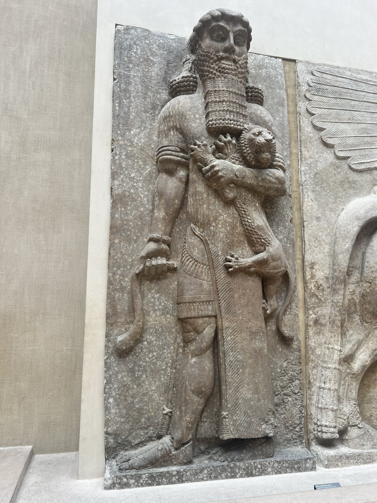{ width=50% }
<figcaption markdown> Héros maîtrisant un lion, façade de la salle du trône </figcaption>
</figure>

Le bas-relief monumental « Héros maîtrisant un lion » fait partie des chefs-d’œuvre des antiquités du Proche-Orient conservés au Louvre, dans le département des Antiquités orientales, salle du trône dite « Cour de Khorsabad ». Daté vers 710 av. J-C et haut de 5,5m, ce relief représente un héros mythique (identifié parfois à Gilgamesh), debout, tenant un fouet et maîtrisant un lion rampant contre sa poitrine—symbole de force et de pouvoir royal. Le lion, animal redouté en Mésopotamie, représente la nature sauvage : la scène illustre la domination de l’ordre royal et civilisateur sur le chaos.

<figure markdown>
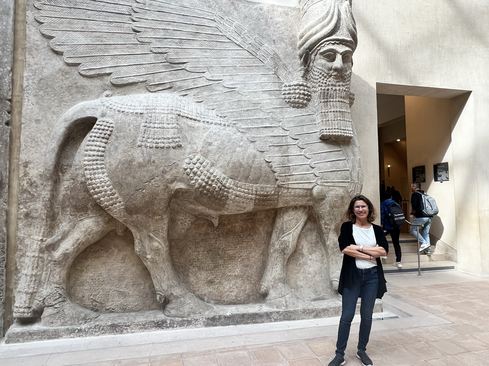{ width=50% }
<figcaption markdown> Un air de Persépolis : les taureaux ailés à tête humaine - Lamassus - sont des génies protecteurs (symboles de force, d’intelligence et de vision surnaturelle), véritables « gardiens ».   </figcaption>
</figure>

<figure markdown>
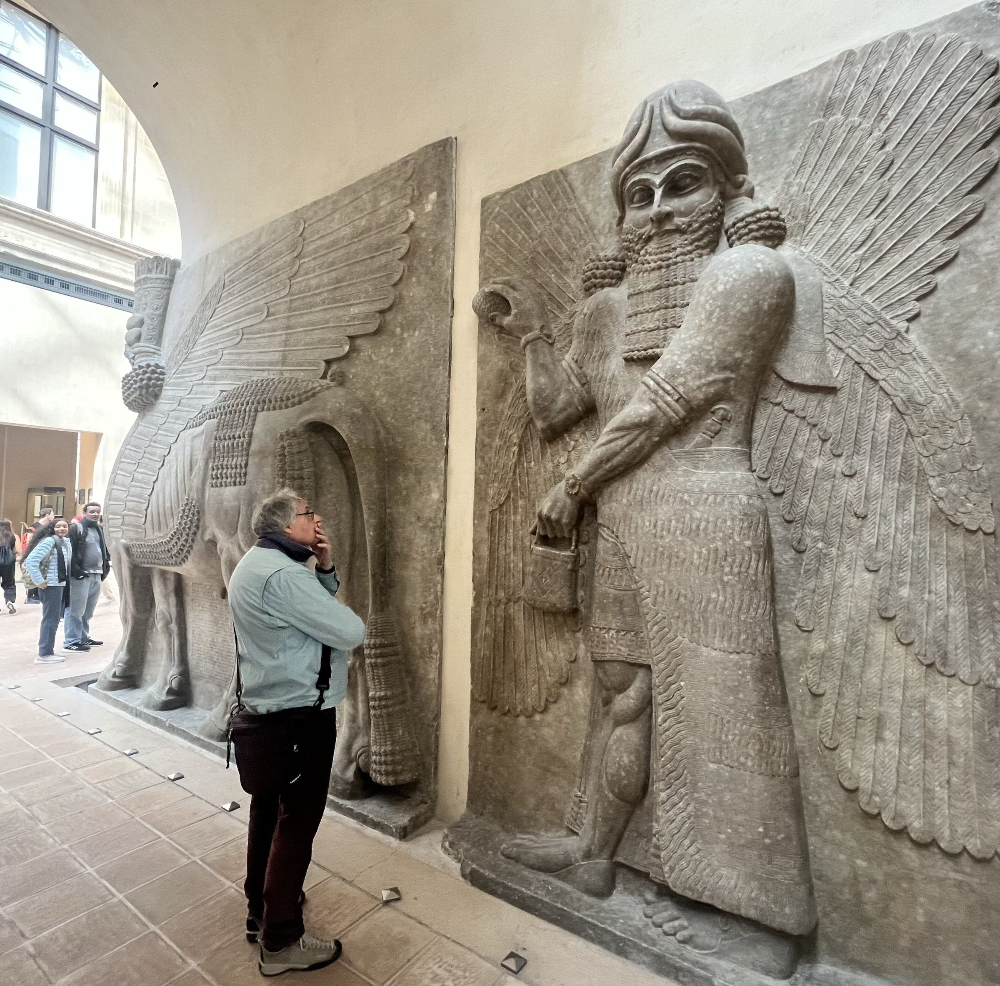{ width=50% }
<figcaption markdown> Bon sang, ça me rappelle quelqu'un... 🤔 mais qui? </figcaption>
</figure>

Particularité : Ces taureaux sont sculptés avec cinq pattes – vus de face, ils semblent immobiles ; vus de côté, ils avancent : cette convention artistique leur donne le double aspect mouvement/repos. La tiare à cornes indique leur statut divin. Positionnés à l’entrée du palais, ils devaient impressionner le visiteur et repousser toute influence néfaste.

<figure markdown>
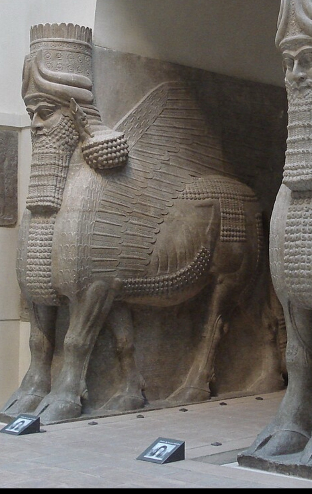{ width=50% }
<figcaption markdown> Mais oui : il a bien cinq pattes! </figcaption>
</figure>

<figure markdown>
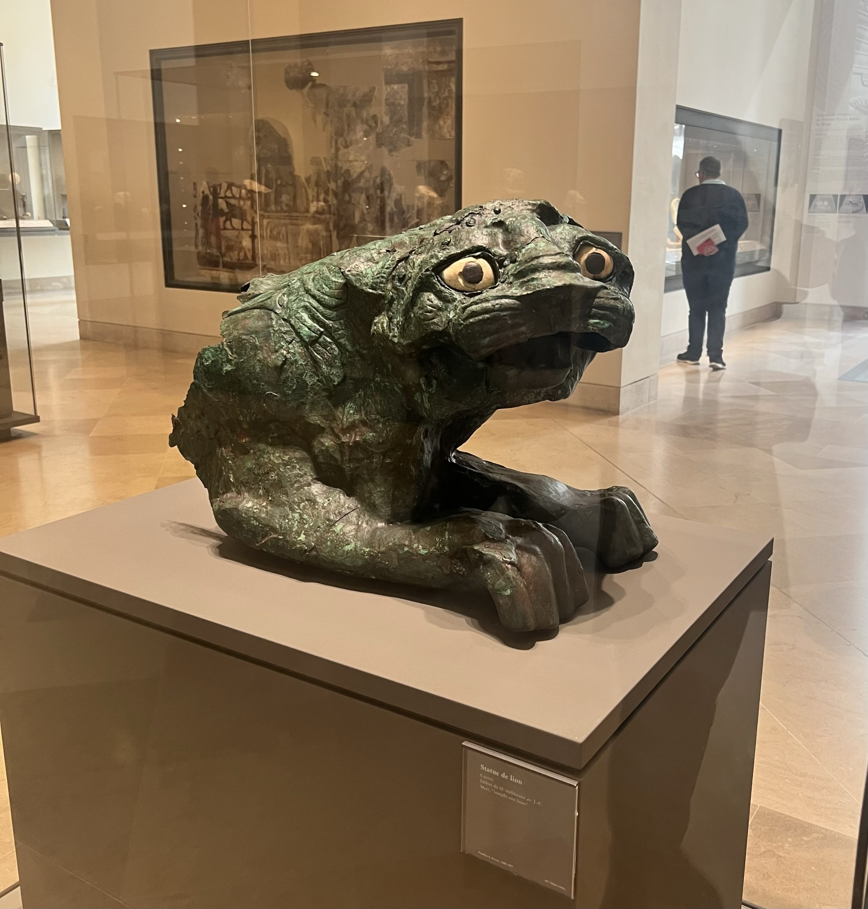{ width=50% }
<figcaption markdown> Lion de Mari, chef-d’œuvre du département des Antiquités orientales du Louvre, datant du début du IIᵉ millénaire av. J.-C. Cuivre martelé sur une âme de bois (technique rare pour l’époque), incrustations minérales pour les yeux ; pattes avant allongées, lion couché, restauré partiellement après sa découverte.  </figcaption>
</figure>

Ce lion, ainsi qu’un autre exemplaire conservé au musée d’Alep, a été retrouvé à l’intérieur du temple dédié à une divinité désignée sous le nom de « Roi du Pays ». Les deux animaux étaient installés l’un près de l’autre sur un podium à gauche de l’entrée du sanctuaire, la partie arrière des deux sculptures était encastrée dans le mur de telle sorte que les deux lions semblaient surgir de la paroi, menaçants, prêts à bondir vers l’intérieur du temple. La tête tournée vers la droite, ils surveillaient les visiteurs à l’entrée comme à la sortie : cette position particulière fait penser qu’ils avaient peut-être une fonction différente de celle des classiques animaux gardiens de porte.
Selon une technique bien attestée au Proche-Orient, le corps du lion est composé de plaques de cuivre fixées à l’aide de clous sur une âme en bois qui a maintenant disparu. Les yeux, incrustés de calcaire et de schiste, et la dentition en os qui garnissait la gueule rugissante du fauve contribuaient à accentuer le caractère réaliste de cette pièce exceptionnelle.

<figure markdown>
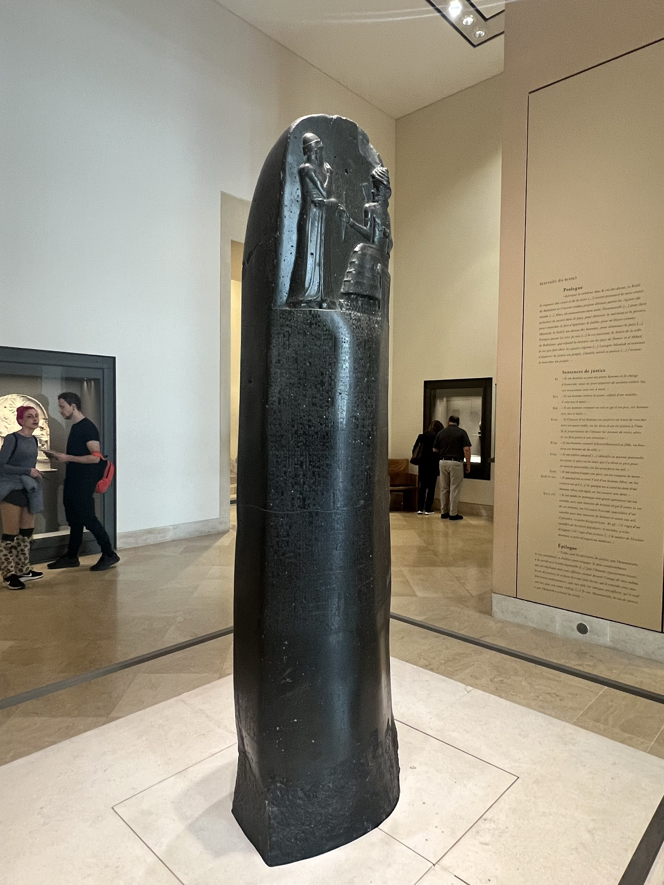{ width=50% }
<figcaption markdown> Le code de Hammurabi </figcaption>
</figure>

Le Code de Hammurabi est le recueil juridique le plus important du Proche-Orient ancien, antérieur aux lois bibliques. La stèle exposée au musée du Louvre, est un monument en basalte rédigé au XVIIIᵉ siècle av. J.-C. à Babylone sous le règne du roi Hammurabi. Gravée en écriture cunéiforme akkadienne, elle expose près de 300 lois couvrant la vie civile, commerciale, familiale et pénale du royaume, et constitue l’un des plus anciens et plus précieux recueils juridiques au monde. La stèle présente aussi une scène où le roi reçoit l’investiture du dieu Shamash, illustrant la légitimité divine du pouvoir et de la justice

<figure markdown>
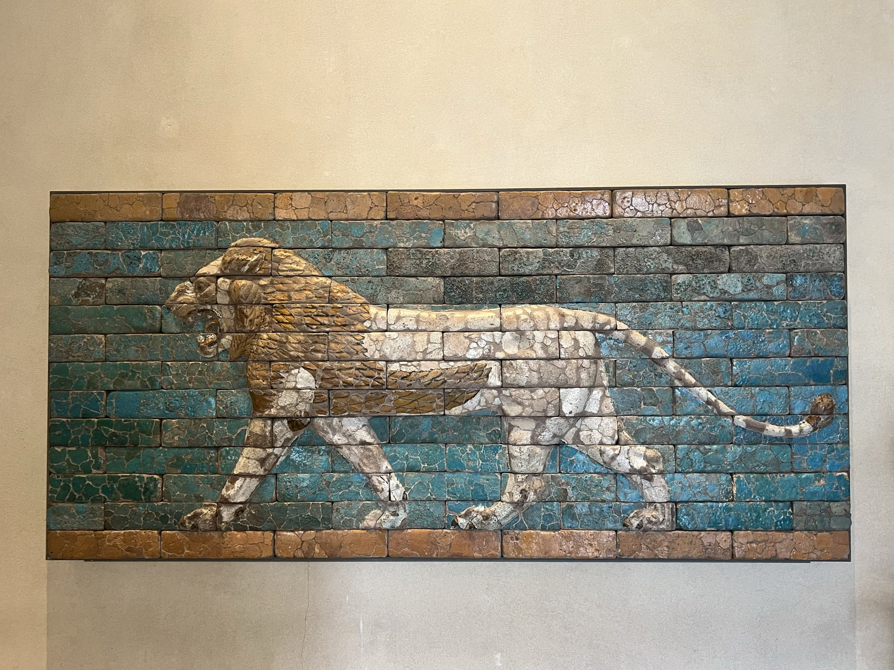{ width=50% }
<figcaption markdown> Panneau de briques : lion passant (terre cuite en glaçure, Babylone - Iraq, règne de Nabuchodonosor II en 600 av. J-C) </figcaption>
</figure>

Ce panneau appartenait au décor de la Voie Processionnelle de Babylone qui conduisait du temple de Marduk au temple de l'Akitu, en passant par la Porte d'Ishtar. Le lion est l'animal attribut de cette déesse. Le cortège des prêtres empruntait cette voie lors des cérémonies de la fête du Nouvel An qui se déroulait à l'équinoxe de printemps. La Voie Processionnelle, mise au jour au cours des fouilles allemandes de Babylone, est partiellement reconstituée au Vorderasiatisches Museum de Berlin.

<figure markdown>
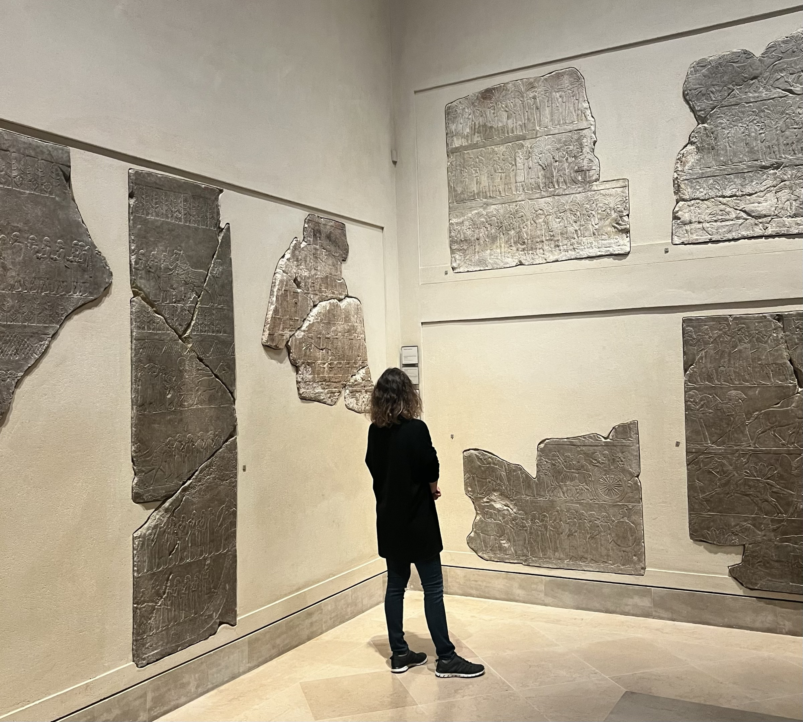{ width=50% }
<figcaption markdown> J'aimerais tant déchiffrer! </figcaption>
</figure>

### Antiquités : Egypte { #sphinx }

<figure markdown>
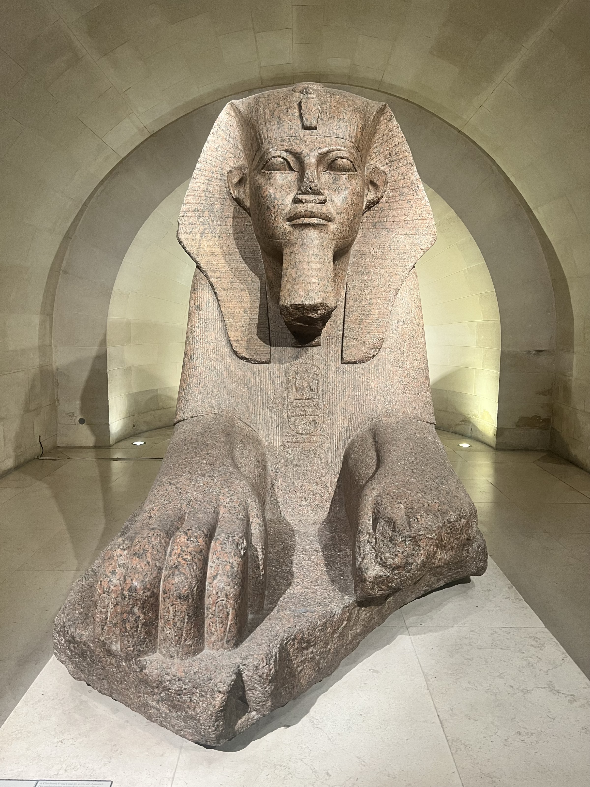{ width=50% }
<figcaption markdown> Magnifique Grand Sphinx de Tanis : à l'inverse des Dieux, les Pharaons avaient le corps d'un animal et une tête humaine. On aperçoit les traces du Cobra sur la coiffe de tête. </figcaption>
</figure>

Le Grand Sphinx de Tanis est une imposante sculpture en granite rose datant probablement du début de l’Ancien Empire égyptien (vers 2600 av. J.-C.), découverte à Tanis dans le delta du Nil. Cette statue colossale représente un pharaon à corps de lion, coiffé du némès caractéristique et portant la barbe postiche royale ainsi que l’uraeus, symbole de pouvoir. D’une longueur d’environ 4,80 m, d’une hauteur de 1,83 m et d’une largeur de 1,54 m, il s’agit de l’un des plus grands sphinx conservés hors d’Égypte. Symbole de la puissance et de la protection royales, cette œuvre était probablement placée à l’entrée d’un temple afin de protéger les lieux sacrés, impressionnant les visiteurs par sa monumentalité et la finesse de sa sculpture.

<figure markdown>
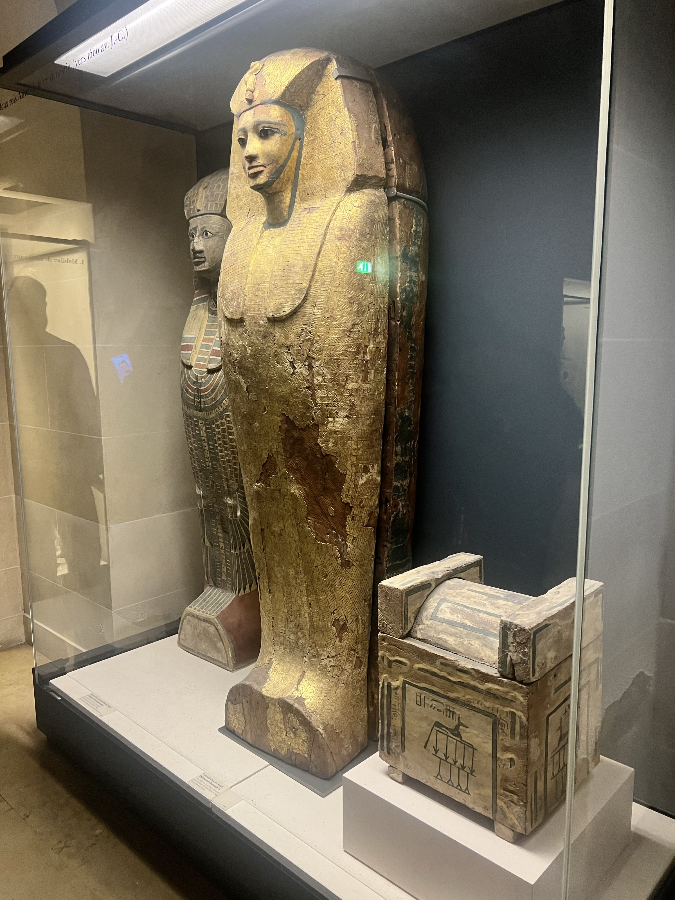{ width=50% }
<figcaption markdown> Sarcophage anthropomorphe </figcaption>
</figure>

- Matériau et style : Ce cercueil est en bois stuqué et peint, souvent doré comme ici, et sculpté en forme humaine afin d’assurer au défunt protection et identification dans l’au-delà. Le visage et la coiffe sont moulés selon les conventions royales et sacerdotales.
- Fonction : Il servait à contenir la momie du défunt, tout en lui garantissant le bénéfice des rites funéraires et la protection magique des dieux.
- Décoration : Les sarcophages anthropomorphes pouvaient porter des représentations du dieu Osiris, des extraits du Livre des morts, des formules d’offrandes et de protection, des motifs d’ailes et de scarabée, et le nom du propriétaire inscrit sur le couvercle ou le socle.

<figure markdown>
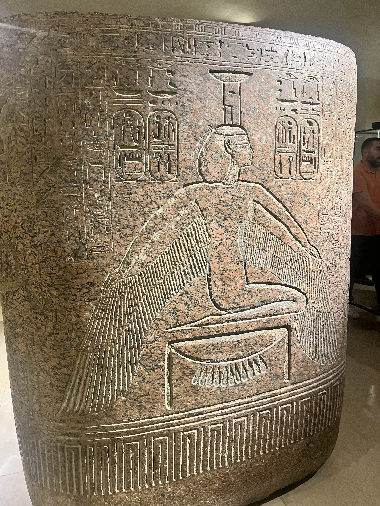{ width=50% }
<figcaption markdown> Gravure sur coffre funéraire : Isis. </figcaption>
</figure>

La gravure visible sur ce fragment de sarcophage ou coffre funéraire égyptien présente la déesse Isis, reconnaissable à son trône posé sur la tête (hiéroglyphe qui compose son nom), souvent représentée assise ou agenouillée, les bras déployés et les ailes étendues en signe de protection.
Iconographie et signification.

- Isis joue dans l’au-delà et les chambres funéraires un rôle de protectrice : ses ailes enserrent le corps du défunt ou le sarcophage, symbolisant sa capacité à envelopper et préserver l’âme.
- Dans l’art funéraire, Isis est souvent accompagnée de Nephthys dans la même posture pour « envelopper » symboliquement la momie et lui garantir renaissance et immortalité.
- Elle est une figure centrale des mythes de la mort et de la résurrection (Osiris), médiatrice entre le monde des vivants et celui des dieux.

<figure markdown>
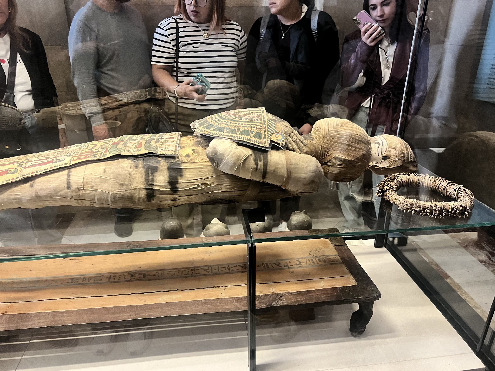{ width=50% }
<figcaption markdown> Momie </figcaption>
</figure>

Cette momie exposée au Louvre est exemplaire de la pratique funéraire égyptienne classique, probablement du Nouvel Empire ou de la Basse Époque.
Description et éléments caractéristiques

- Momification : Le corps est enveloppé de nombreuses bandes de lin, la tête et les mains modelées soigneusement. Le visage peut être peint ou recouvert d’un masque stylisé pour rappeler la physionomie du défunt.
- Ornementation : Sur le torse et les jambes, on distingue des cartonnages peints : il s’agit de plaques de carton enduites, décorées de scènes religieuses et de textes du Livre des morts, destinées à protéger symboliquement la momie.
- Collier et objets funéraires : Au niveau de la tête, on aperçoit un collier ou une guirlande végétale, offrande traditionnelle associée à la momie ; au sol, des pots de faïence pouvant servir aux offrandes alimentaires ou rituelles, voire à contenir des viscères (vases canopes).

<figure markdown>
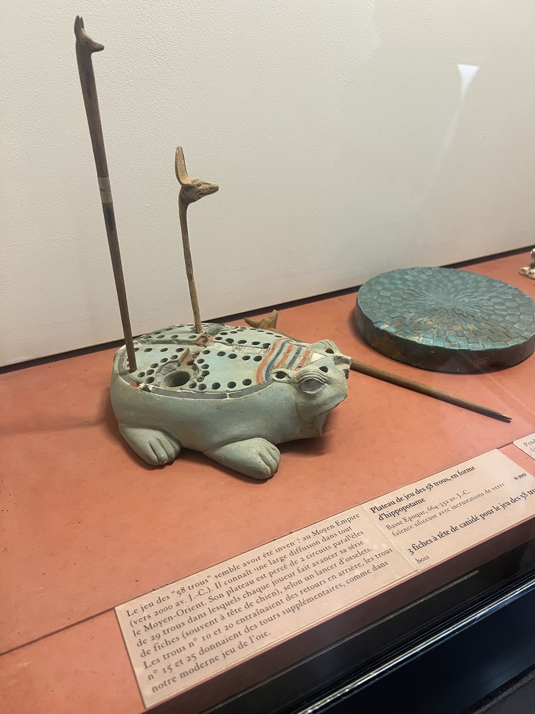{ width=50% }
<figcaption markdown> Les Egyptiens jouaient aussi ! </figcaption>
</figure>

### Antiquités : Grèce et Rome {#greco-romain}

<figure markdown>
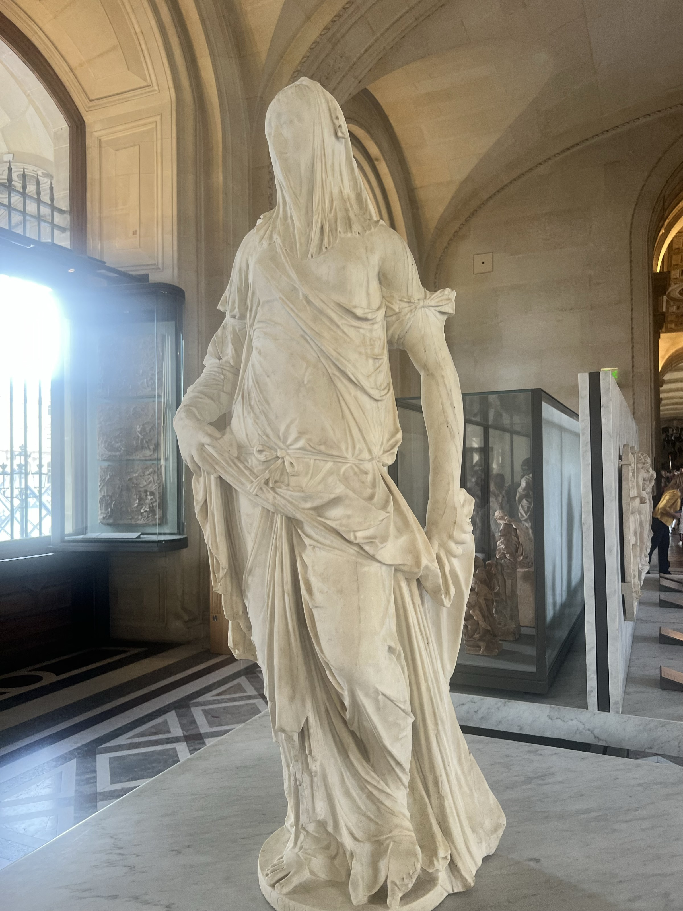{ width=50% }
<figcaption markdown> Femme voilée (Antonio Corradini, vers 1717) </figcaption>
</figure>
Corradini s'était fait une spécialité de ce type de figure voilée, un tour de force qu'il utilisa pour représenter les figures les plus diverses.

<figure markdown>
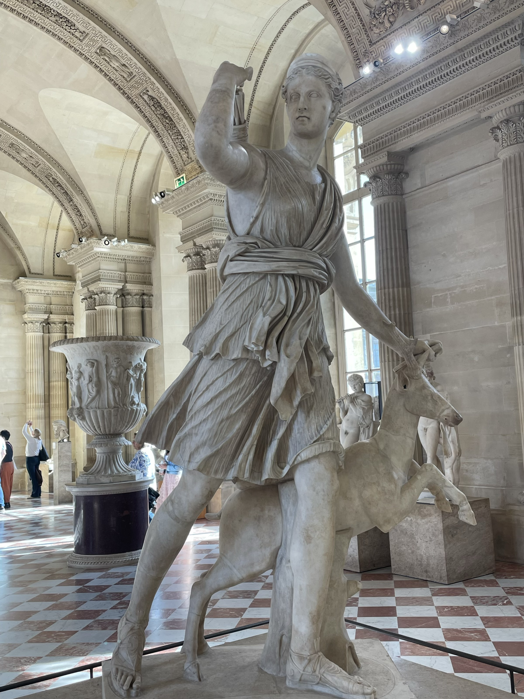{ width=50% }
<figcaption markdown> Diane Chasseresse </figcaption>
</figure>

La célèbre Diane chasseresse dite aussi « Diane de Versailles », est un chef-d’œuvre de la sculpture gréco-romaine. 
Description

- Elle figure Diane (Artemis en grec), déesse de la chasse, de la nature sauvage et de la lune, identifiée par sa tunique courte et son carquois.
- Diane avance d’un pas vif, tenant un arc (dont le morceau est parfois manquant), accompagnée d’une biche qui bondit à ses côtés — symbole de pureté et de la nature qu’elle protège.
- Il s’agit d’une copie romaine en marbre (Ier ou IIe siècle ap. J.-C.) d’après un original grec en bronze du IVe siècle av. J.-C., attribué à Léocharès. La version présentée au Louvre est arrivée sous Henri II comme ornement du château de Fontainebleau, avant d’intégrer les collections royales puis nationales.
Contexte culturel : Diane exprime l’idéal féminin antique (indépendance, énergie, beauté) et la puissance du divin en dialogue avec la nature. La composition dynamique, le vêtement volant et la grâce du mouvement font de cette œuvre un modèle classique de la statuaire antique et renaissante.

<figure markdown>
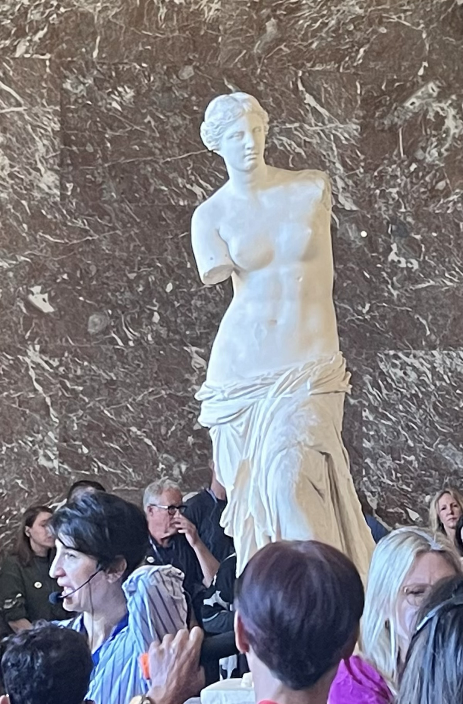{ width=50% }
<figcaption markdown> La Vénus de Milo : sculpture grecque et non une copie romaine. Le nez a été refait! Estimée du 2ème siècle av JC. </figcaption>
</figure>

La Vénus de Milo est l’une des statues antiques les plus célèbres au monde. Découverte en 1820 sur l’île grecque de Milo, elle a rapidement rejoint les collections du Louvre en 1821. Sculptée en marbre vers 150–130 av. J.-C., elle représente une déesse à demi nue, généralement identifiée à Aphrodite (Vénus pour les Romains), la déesse de l’amour et de la beauté. L’absence de ses bras fait partie de son mystère et nourrit l’imaginaire des visiteurs : plusieurs hypothèses existent sur la position qu’ils occupaient (tenant une pomme, ou un miroir…). Son style conjugue l’élégance classique et le raffinement hellénistique, faisant d’elle un symbole universel de la beauté féminine. L’œuvre fascine aussi par son histoire mouvementée et par le débat sur son identification : certains la relient à Amphitrite, divinité locale de Milo, mais la représentation sensuelle penche pour Aphrodite.

!!! note "L'idée de la pomme évoque la pomme de la discorde"

    Le mythe grec de la 🍏 « pomme de la discorde » débute au mariage de Pélée et Thétis, auquel la déesse Éris (Discorde) n’est pas invitée. Pour se venger, elle jette au banquet une pomme d’or portant l’inscription « À la plus belle ».

    Trois déesses — Héra, Athéna et Aphrodite — revendiquent le fruit. Incapable de les départager, Zeus confie le choix au mortel Pâris. Chacune fait une promesse : Héra offre la puissance, Athéna la victoire, Aphrodite l’amour de la plus belle femme au monde — Hélène de Sparte. Pâris remet la pomme à Aphrodite, enlève Hélène à Sparte et déclenche la guerre de Troie. Depuis, « pomme de discorde » désigne le point de départ d’un conflit important!

<figure markdown>
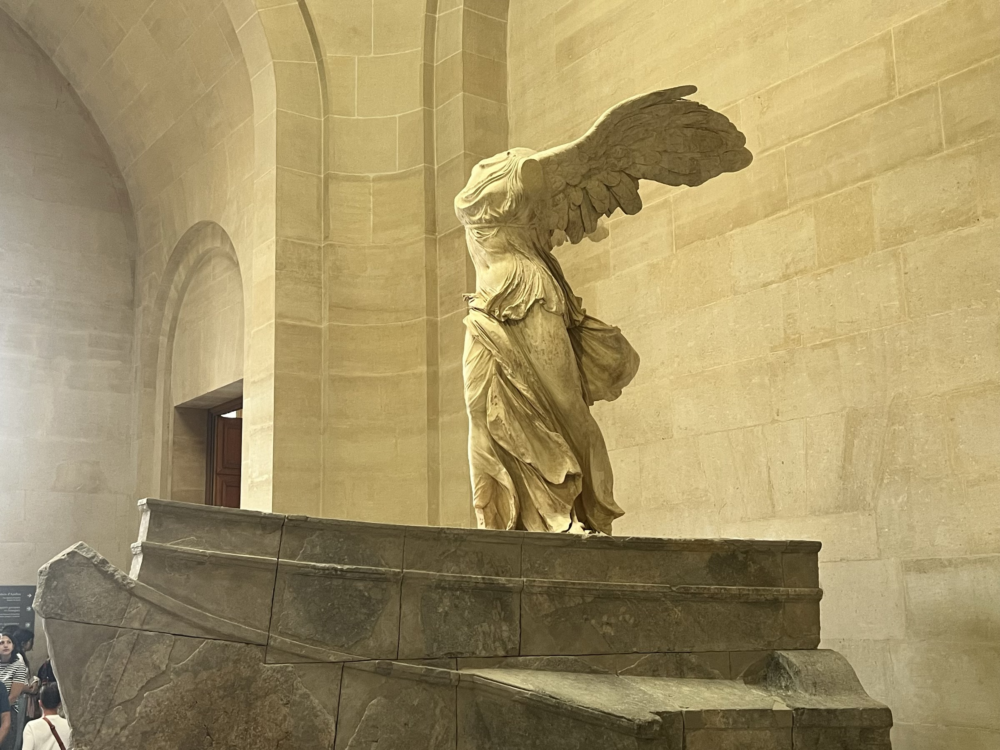{ width=50% }
<figcaption markdown> Victoire de Samothrace : ses ailes ont inspiré le logo de la marque Nike. </figcaption>
</figure>

La Victoire de Samothrace (Nikè) est une sculpture monumentale du IIᵉ siècle av. J.-C., chef-d’œuvre de l’art hellénistique grec. Exposée en majesté au sommet de l’escalier Daru du Louvre, elle fut découverte en 1863 sur l’île de Samothrace, où elle ornait le sanctuaire des Grands Dieux. Elle représente la déesse ailée de la Victoire, saisie au moment où elle prend son envol ou atterrit sur la proue d’un navire : le mouvement du drapé et la force du torse expriment la puissance et le souffle divin. Sa tête et ses bras sont manquants, accentuant son caractère énigmatique. Cette œuvre commémore une victoire navale et fut conçue comme une offrande religieuse — son emplacement élevé au Louvre renforce l’effet spectaculaire et la sensation de triomphe qu’elle incarne.

### Peintures : Italie et France {#peinture}

<figure markdown>
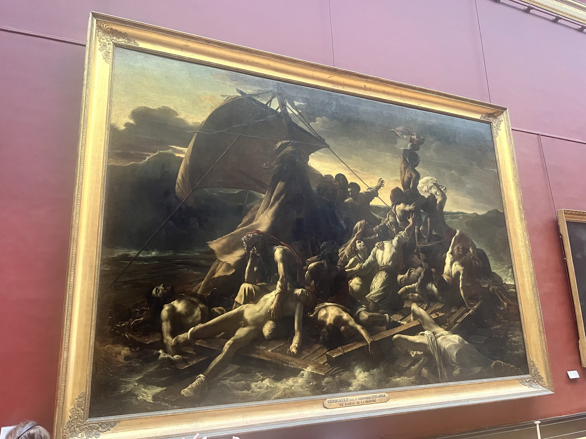{ width=50% }
<figcaption markdown> Le Radeau de la Méduse (Géricault) </figcaption>
</figure>

Le Radeau de la Méduse, peint par Théodore Géricault entre 1818 et 1819, est l’une des œuvres les plus emblématiques du Louvre et un jalon majeur du romantisme français. Géricault, alors âgé de 27 ans, a mené une enquête approfondie pour réaliser ce tableau : il a rencontré des rescapés du naufrage, un événement devenu scandale national et qui fascina l’opinion publique, à l’instar du vol de la Joconde un siècle plus tard. L’artiste sublime les émotions, donne une dimension tragique à la scène, et aborde en filigrane la question de l’esclavage : il faut rappeler que la Révolution française avait aboli l’esclavage dès 1794, avant que Napoléon Ier ne le rétablisse en 1802 ; l’abolition définitive ne sera votée qu’en 1848.

Sur la toile, le personnage noir qui s’élève et agite son linge vers l’horizon est souvent interprété comme une figure d’espoir et de libération : il symbolise l’attente du salut, mais aussi l’émancipation de tous les opprimés, particulièrement ceux qui étaient encore soumis à l’esclavage au moment de la réalisation du tableau. 

Aujourd’hui exposé au Louvre, ce chef-d’œuvre pose également des défis de conservation : la présence de zinc dans la toile rendrait une restauration future très difficile, au point que certains spécialistes redoutent sa disparition d’ici à cinquante ans.

!!! note "Un naufrage qui fit scandale!"
    
    Le naufrage de la Méduse fut un scandale en France, car il révéla l’incompétence et le népotisme présents au sommet de l’État royaliste restauré. En 1816, le navire était commandé par Hugues Duroy de Chaumareys, un capitaine qui n’avait pas navigué depuis vingt-cinq ans et qui avait été nommé à ce poste principalement pour des raisons politiques. Son manque d’expérience causa l’échouage de la frégate sur un banc de sable au large de la Mauritanie, alors que des procédures standard auraient permis d’éviter la catastrophe.
    
    L’affaire prit une dimension nationale et politique car la gestion du sauvetage fut désastreuse : les officiers et passagers les plus gradés se sont attribué les places dans les canots, tandis que 150 personnes furent abandonnées sur un radeau de fortune. Les survivants ont ensuite enduré la faim et la soif, des violences extrêmes, du cannibalisme et des meurtres. Le rapport du chirurgien Savigny, accompagné de récits publiés dans la presse, exposa ces faits à l’opinion publique, mettant en lumière les abus de pouvoir, l’irresponsabilité du commandement et amplifiant la crise politique de la monarchie, ce qui fit du naufrage un véritable scandale d’État

<figure markdown>
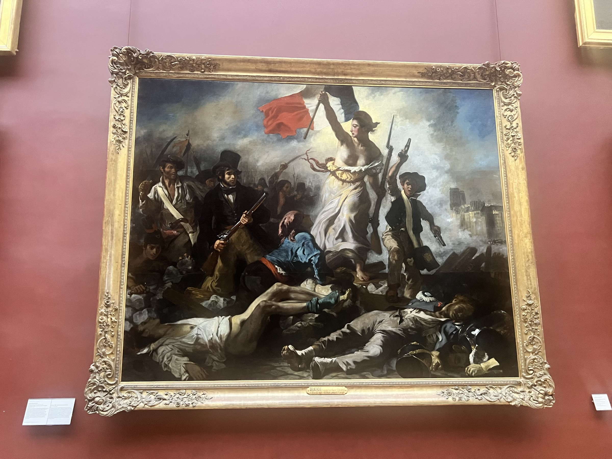{ width=50% }
<figcaption markdown> « La Liberté guidant le peuple » peint par Eugène Delacroix en 1830, juste après la révolution des Trois Glorieuses (27, 28 et 29 juillet 1830) </figcaption>
</figure>

L’ambiguïté du tableau « La Liberté guidant le peuple » de Delacroix tient à la fois au contexte politique et à la personnalité de l’artiste. Delacroix n’était pas franchement républicain : il était libéral, admirateur de Napoléon, mais aussi proche du nouveau roi Louis-Philippe, qui cherchait à rallier la France après la Révolution de 1830. 

Le tableau célèbre le soulèvement 😡 contre Charles X  et la fin de la dynastie des Bourbons 💪; Delacroix choisit d’incarner la Liberté par une femme du peuple – une figure réaliste et charnelle, dont les détails comme la pilosité sous les aisselles montrent qu’il ne veut pas styliser ni idéaliser son sujet. Cette femme entraîne tous les révolutionnaires à Paris (tours de N-D à l'arrière-plan), mais elle n’a pas encore le statut républicain qu’elle recevra plus tard sous la IIIème République : elle incarne d’abord l’esprit de 1830, c’est-à-dire un désir de liberté traversant les classes populaires, sans être purement républicain.

La Monarchie de Juillet, établie par Louis-Philippe "1er roi citoyen", se présente comme une monarchie constitutionnelle et libérale, mais elle reste fondée sur le suffrage censitaire : le pouvoir est réservé aux plus riches et la vraie démocratie est encore lointaine. 

L’œuvre est ainsi à la fois une ode à la souveraineté du peuple et une illustration des paradoxes de l’époque, où le drapeau tricolore réapparaît, mais la République n’est encore qu’un horizon, pas une réalité politique. Delacroix y propose donc une allégorie forte, mais subtile, de la liberté populaire, qui sera interprétée bien plus tard comme « Marianne », figure de la République triomphante.

<figure markdown>
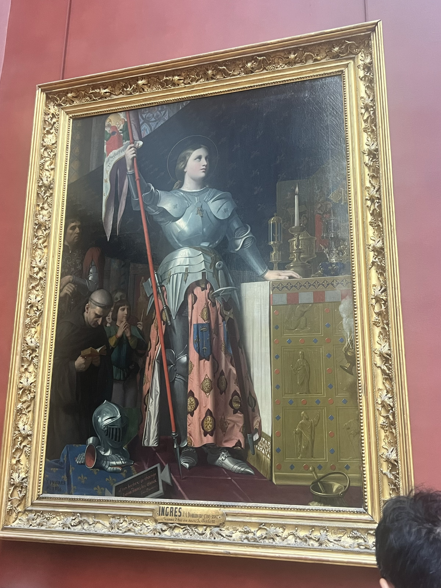{ width=50% }
<figcaption markdown> « Jeanne d’Arc au sacre du roi Charles VII, dans la cathédrale de Reims » - 1854 </figcaption>
</figure>

Un symbole particulièrement fort dans ce tableau d’Ingres est la représentation de Jeanne d’Arc (dite "La Pucelle d'Orléans") en armure, la main posée sur l’autel garni d’objets liturgiques et royaux, rendant ainsi hommage à la fois au sacré et à la légitimité monarchique. 

L’étendard qu’elle tient rappelle son rôle de messagère divine, tandis que les lys, omniprésents sur le tissu et les décors, symbolisent la royauté française. Un détail notable : Ingres la dote d’une auréole, anticipant sa canonisation, et affirme ainsi son statut de sainte nationale alors que l’Église ne l’a pas encore reconnue officiellement.

<figure markdown>
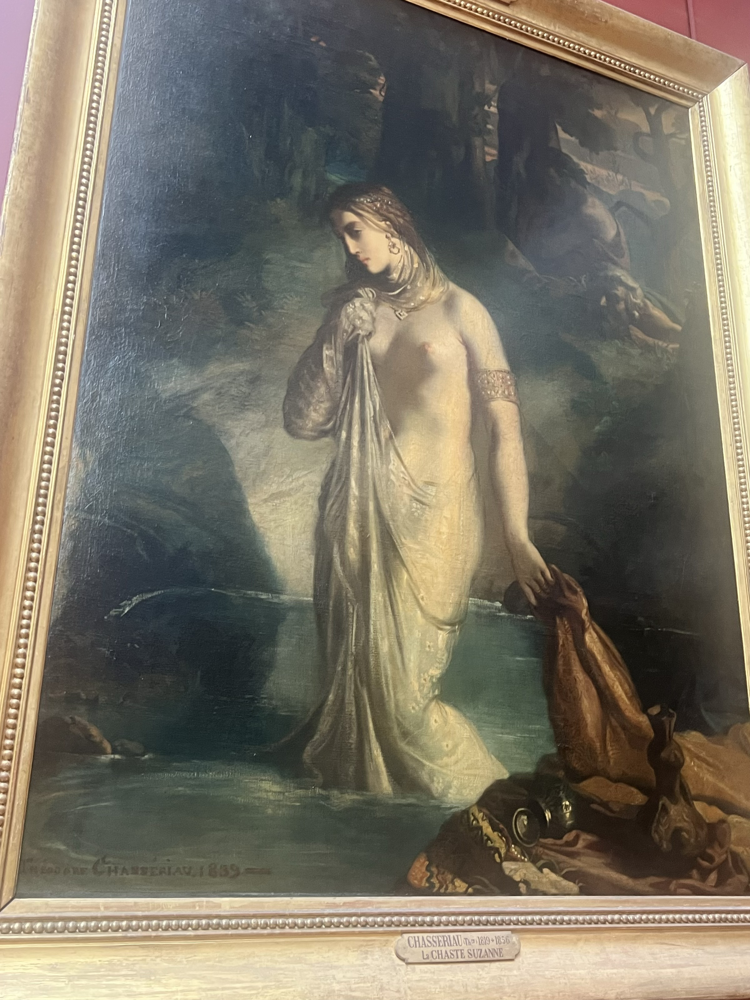{ width=50% }
<figcaption markdown> "La chaste Suzanne" - 1839, Théodore Chassériau </figcaption>
</figure>

Ce tableau s’intitule « Suzanne au bain » (souvent nommé « La chaste Suzanne »). L’œuvre illustre l’épisode biblique de Suzanne, symbole de pureté et d’innocence injustement accusée, surprise lors de son bain. Chassériau met en valeur la transparence de la draperie mouillée, sublimant à la fois la chasteté et la sensualité du personnage. Un fait notable : la scène, à la fois pudique et sensuelle, montre l’influence de ses deux maîtres, Ingres (pour la pureté du dessin) et Delacroix (pour les effets de lumière et d’atmosphère)

<figure markdown>
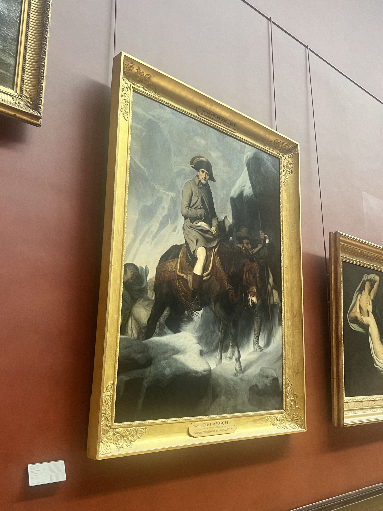{ width=50% }
<figcaption markdown> « Bonaparte franchissant les Alpes » - 1848, Paul Delaroche </figcaption>
</figure>

Ce tableau montre Napoléon lors du passage du col du Grand-Saint-Bernard en 1800, non pas sur un cheval cabré et triomphant comme dans la célèbre version de David, mais sur une simple mule, dans une posture humble, enveloppé dans une redingote grise, accompagné d’un guide.

Fait notable : Delaroche opte pour le réalisme, illustrant la difficulté et la dimension humaine de cette expédition hivernale, loin de l’imagerie héroïque. Ce choix, à rebours de la glorification traditionnelle, met en avant la ténacité et l’endurance de Napoléon lors de la traversée des Alpes avec son armée, un épisode clé de la campagne d’Italie

<figure markdown>
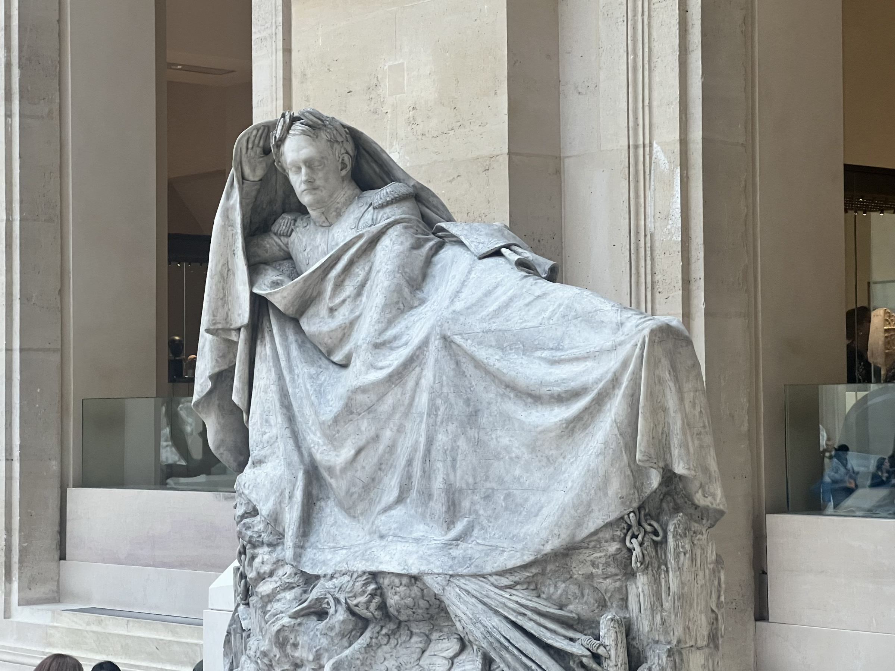{ width=50% }
<figcaption markdown> « Napoléon s’éveillant à l’Immortalité » - 1847 </figcaption>
</figure>

Il s’agit de « Napoléon s’éveillant à l’Immortalité », aussi appelée parfois « Le Réveil de Napoléon », réalisée par François Rude en 1847 (plâtre, modèle pour un monument funéraire). La sculpture montre l’empereur en manteau et couronne de laurier, se relevant comme d’un linceul, suggérant à la fois la mort et la résurrection glorieuse.

Fait notable : l’attitude de Napoléon, le visage serein et les yeux clos, confère à l’œuvre un caractère à la fois funèbre et héroïque — une sorte d’allégorie de la survivance du mythe napoléonien, figurant le retour à l’immortalité dans la mémoire nationale, bien après la fin de son règne.

<figure markdown>
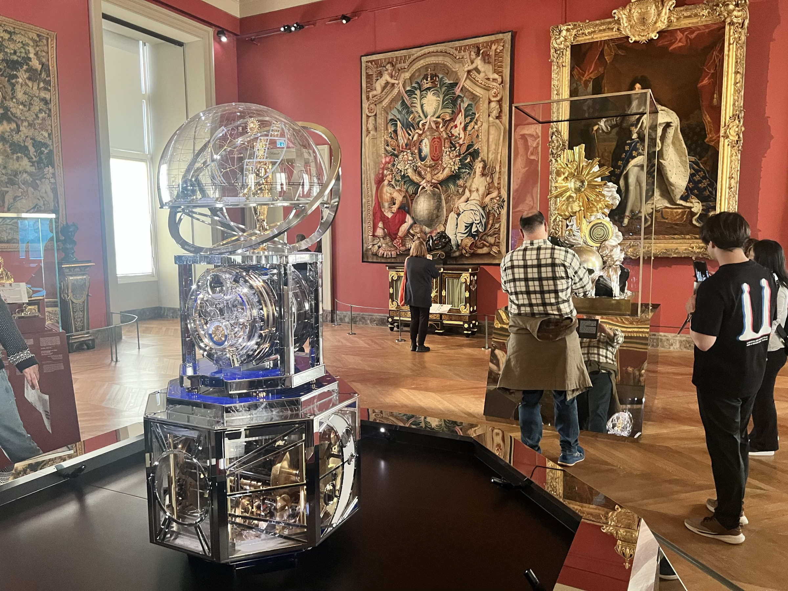{ width=50% }
<figcaption markdown> Louis Le Grand (XIV) et la Quête du Temps! </figcaption>
</figure>

<figure markdown>
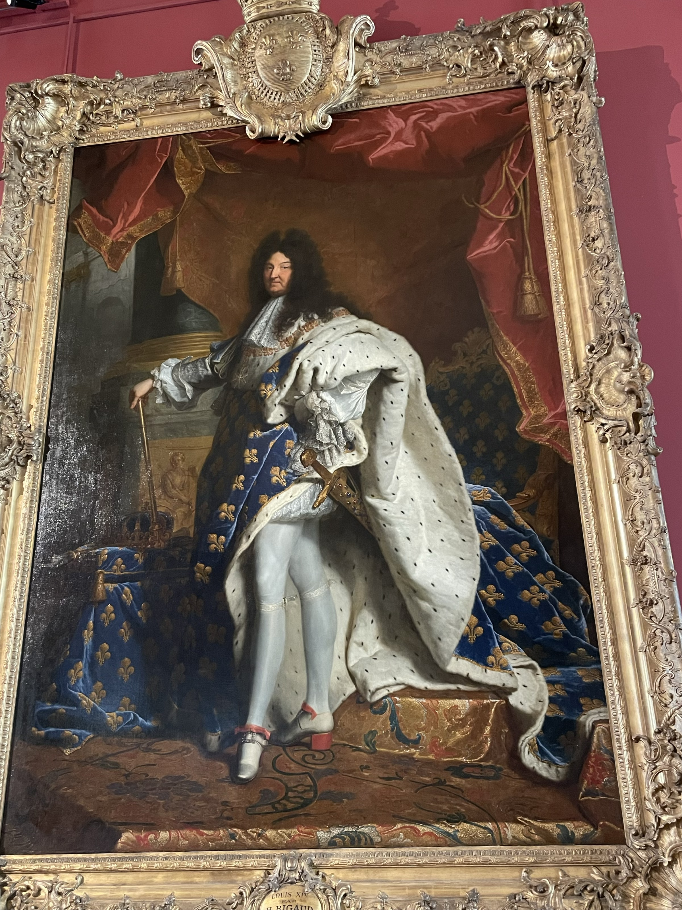{ width=50% }
<figcaption markdown> Louis XIV </figcaption>
</figure>

<figure markdown>
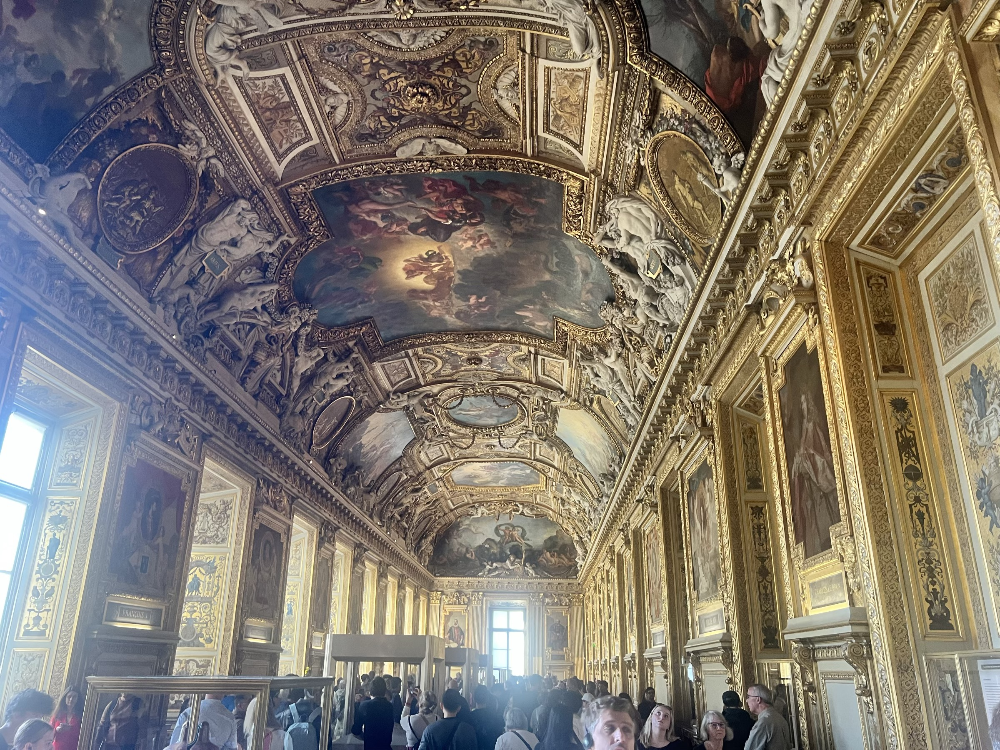{ width=50% }
<figcaption markdown> Galerie d'Appollon </figcaption>
</figure>

La **Galerie d'Apollon** constitue une  ébauche de la Galerie des Glaces car après 20 ans, le roi Soleil Louis XIV déménagera du Louvre au Chateau de Versailles. On peut y voir notamment les Joyaux de la Couronne, une collection initiée par François 1er qui utilise le trésor pour acheter un premier rubis :  le Côte de Bretagne. Autre pièce marquante : Le Régent, diamant d'une taille conséquente et réputé être le plus pur au monde (transparence exceptionnelle). Époque Louis XV (Philippe d’Orléans n’est pas le père mais le cousin du roi, il exerce le pouvoir en son nom pendant la minorité du jeune Louis XV.).

!!! notes "Tapisseries murales peintes"

    Certains portraits installés sur les murs de la galerie d’Apollon sont bien des tapisseries tissées (et non des peintures sur toile ou bois). En effet, lors de la restauration du Louvre au XIXᵉ siècle (Sous Napoléon III et le Second Empire), une commande de l’État fut passée à la Manufacture des Gobelins pour exécuter des grandes tapisseries de haute lisse représentant les rois, reines et artistes liés au Louvre et à son histoire.
    
    Ces portraits sont donc tissés en laine, coton et soie, selon la technique traditionnelle des Gobelins, d’après des cartons peints par des artistes comme Appert, Jobbé-Duval, ou sur des modèles de Hyacinthe Rigaud pour Louis XIV. Elles sont fixées aux murs, à l’instar de véritables tableaux, et viennent compléter le décor somptueux de la galerie d’Apollon : elles incarnent l’alliance du prestige textile français et de la représentation dynastique, et sont bien des œuvres tissées (pas peintes).

<figure markdown>
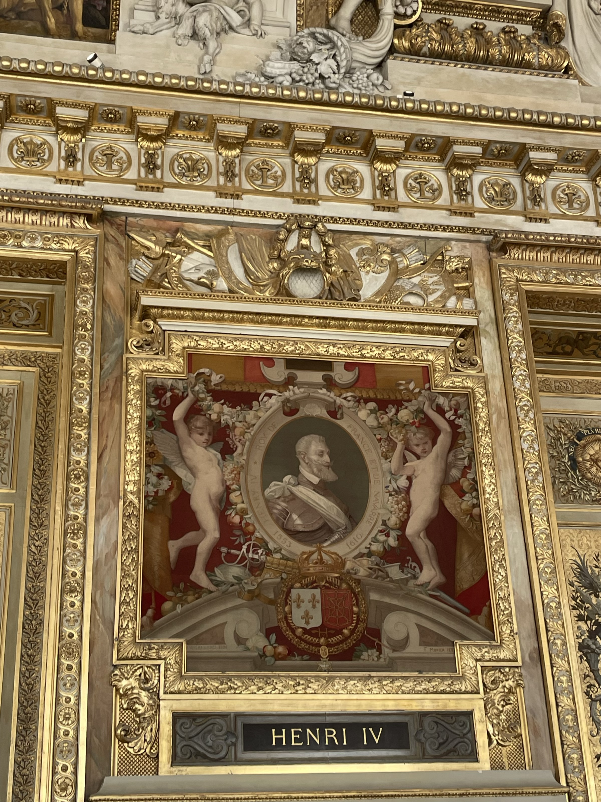{ width=50% }
<figcaption markdown> Tapisserie murale : Henri IV </figcaption>
</figure>

Exemple de tapisserie tissée : ce portrait ornemental d’Henri IV dans la galerie d’Apollon. Il s’agit d’une grande tapisserie réalisée à la manufacture des Gobelins à la fin du XIXe siècle, d’après un modèle de Paul-Victor Galland. On y voit Henri IV en buste, en armure, ceint de l’écharpe blanche des Bourbons, entouré d’une profusion de fruits, de guirlandes et de figures ailées qui célèbrent son règne. Au bas du médaillon figurent les armoiries de France et de Navarre, surmontées de la couronne royale et encadrées des colliers des ordres de Saint-Michel et du Saint-Esprit, soulignant à la fois l’héritage dynastique et l’union des royaumes.

Henri IV (1553-1610), roi de Navarre puis de France à partir de 1589, est célébré pour avoir rétabli la paix civile après les guerres de Religion en promulguant l’édit de Nantes en 1598, qui garantit une certaine tolérance religieuse. Il favorisa la reconstruction économique, encouragea l’agriculture, l’urbanisme et le commerce, et œuvra à la centralisation du pouvoir monarchique. La galerie d’Apollon met à l’honneur les grands souverains bâtisseurs du Louvre, et Henri IV est ici glorifié à la fois comme pacificateur et comme grand roi modernisateur de la capitale et du royaume.

<figure markdown>
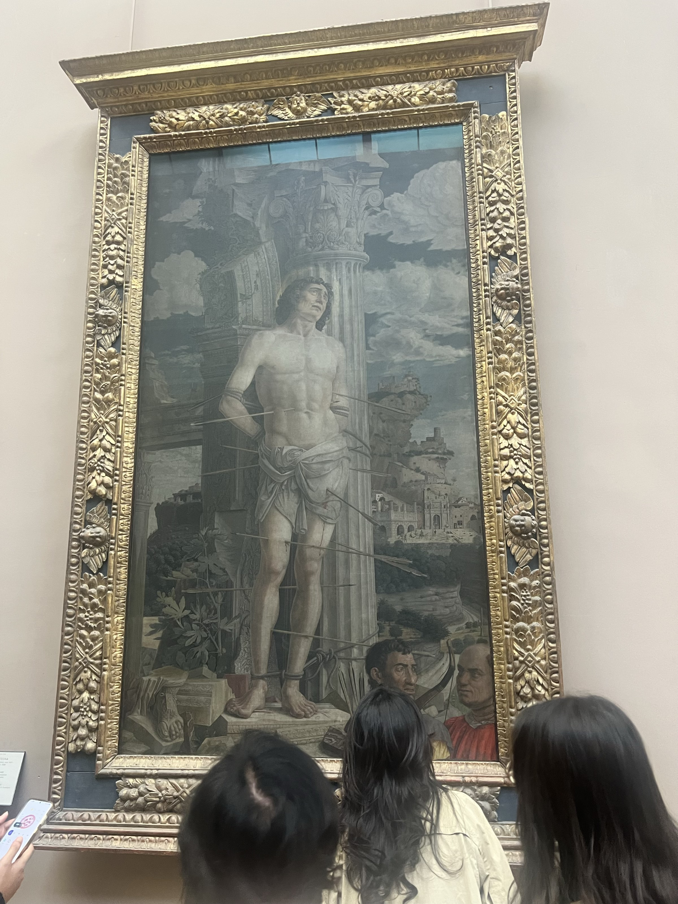{ width=50% }
<figcaption markdown> Un air bien triste : Saint Sébastien peint par Andrea Mantegna vers 1480 </figcaption>
</figure>

Ce tableau est le Saint Sébastien peint par Andrea Mantegna vers 1480, chef-d’œuvre de la Renaissance italienne. Il représente le martyr chrétien attaché à une colonne antique, transpercé de flèches, devant un décor de ruines et d’architecture classique. Mantegna y multiplie les références à l’Antiquité : la colonne corinthienne, les vestiges, mais aussi la précision de la musculature et la rigueur du dessin sont typiques de son style archéologique et humaniste.

Un fait notable : Mantegna a signé l’œuvre en grec sur la colonne, et la composition symbolise autant la souffrance humaine que l’espérance chrétienne. Le Saint Sébastien était considéré, à l’époque, comme un protecteur contre la peste, et la force de l’œuvre tient à sa synthèse entre spiritualité, beauté du corps et innovation de la perspective.

<figure markdown>
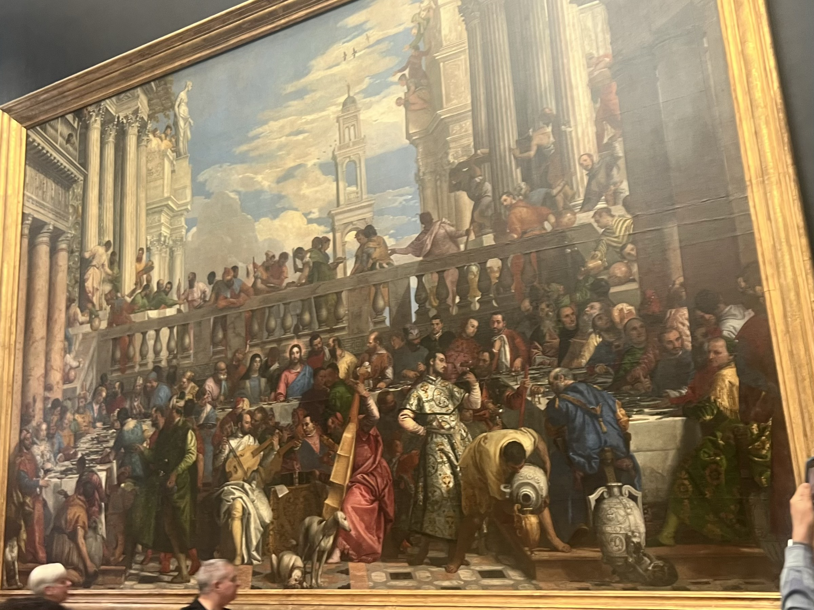{ width=50% }
<figcaption markdown> Plus grand tableau du Louvre : Noces de Cana - 1563, Paolo Véronèse </figcaption>
</figure>

Ce tableau monumental est peint pour le réfectoire du monastère San Giorgio Maggiore à Venise. Avec ses dimensions record de près de 10 mètres sur 7 (exactement 6,77 x 9,94 mètres), il est le plus grand tableau du musée. L’œuvre met en scène le récit biblique du premier miracle du Christ : lors d’un banquet de mariage à Cana, Jésus transforme l’eau en vin pour sauver la fête.

Véronèse transpose cet épisode dans une Venise fastueuse du XVIe siècle, réunissant 132 personnages aux costumes vénitiens mêlés aux figures bibliques (Jésus, Marie, les mariés sur la gauche). 

Un fait notable : Véronèse a intégré à la scène de nombreux portraits contemporains, dont probablement le sien parmi les musiciens au centre. Le foisonnement de détails, l’architecture illusoire et l’ambiance festive font des Noces de Cana un chef-d’œuvre de couleur, de vie et d’inventivité. 

<figure markdown>
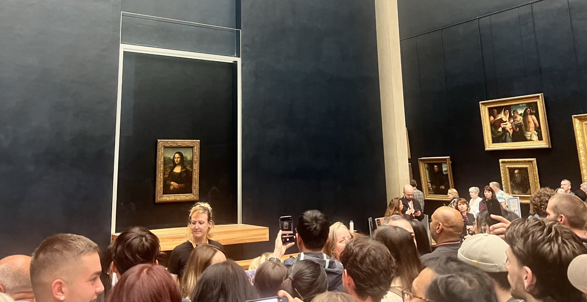{ width=50% }
<figcaption markdown> Mona Lisa et ses adorateurs </figcaption>
</figure>

La Joconde, chef-d’œuvre de Léonard de Vinci, est un portrait peint sur panneau de bois, célèbre pour la finesse de sa technique et la subtilité de son sfumato. Vinci aurait travaillé sur le tableau pendant plus d’une décennie, le reprenant régulièrement pour atteindre une perfection inégalée, ce qui rend la toile très difficile à copier, notamment en raison des craquelures caractéristiques visibles dans le bois, surtout à l’arrière.

Le sourire de Mona-Lisa est surprenant pour l'époque. À la Renaissance, il était extrêmement rare de représenter un personnage, encore moins un portrait féminin, avec un sourire aussi subtil, mystérieux, et vivant. Ce sourire « suspendu » intrigue autant par son ambiguïté (servi par la maîtrise du sfumato et du modelé chez Vinci) que par sa réussite : il semble tour à tour doux, énigmatique ou malicieux, s’effaçant ou réapparaissant selon le regard du spectateur.

Ce caractère unique – ni franchement joyeux, ni figé, mais empreint d’un charme indéfinissable – a fasciné les artistes, poètes et le public, faisant du sourire de Mona Lisa un élément central de sa légende et l’un des premiers sourires véritablement modernes de l’histoire de la peinture occidentale.

La renommée internationale de la Mona Lisa s’est amplifiée après son vol au Louvre en 1911 par Vincenzo Peruggia, un ouvrier italien. Le tableau est resté introuvable durant deux ans : cet événement captivant a attiré des foules venues admirer le cadre vide, et la presse mondiale s’est emparée de l’affaire, transformant l’œuvre en véritable icône. Après sa récupération à Florence en 1913, la Joconde est devenue le tableau le plus connu du musée, surpassant sa seule valeur artistique. François Ier acheta le portrait à la fin de la vie de Vinci.

<figure markdown>
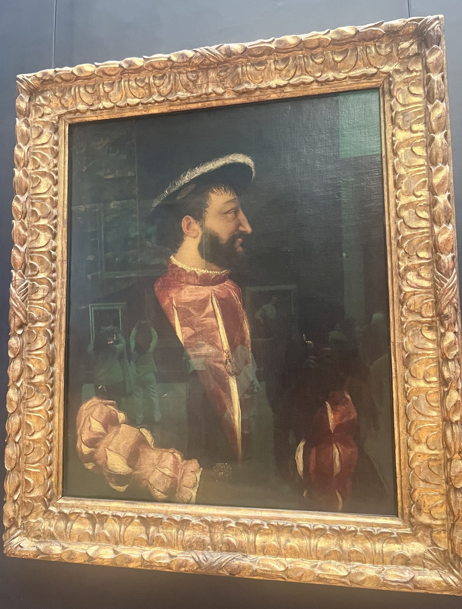{ width=50% }
<figcaption markdown> François 1er avait du nez ! </figcaption>
</figure>

### Frise historique

::timeline:: center

- content: Grand Sphinx de Tanis   [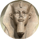{ width="50" }](#sphinx)
  # icon: ':material-rocket-launch-outline:'
  sub_title: 2'600 av. J-C
  title: Antiquité (Egypte)

- content: Lion de Mari ; Stèle de Hammurabi   [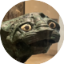{ width="50" }](#proche-orient) [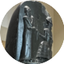{ width="50" }](#proche-orient)
  sub_title: 2'000 av. J-C
  title: Antiquité (Sumer)
  
- content: Buste d'Akhenaton   [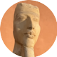{ width="50" }](#sphinx)
  sub_title: 1'350 av. J-C
  title: Antiquité (Egypte)

- content: Héros maitrisant un lion   [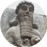{ width="50" }](#proche-orient)
  sub_title: 710 av. J-C
  title: Antiquité (Babylone)
  
- content: Lion sur brique   [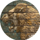{ width="50" }](#proche-orient)
  sub_title: 600 av. J-C
  title: Nabuchodonosor II
  
- content: Diane Chasseresse   [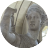{ width="50" }](#greco-romain)
  sub_title: 400 av. J-C
  title: Antiquité (Grèce)
  
- content: Vénus de Milo ; Victoire de Samothrace   [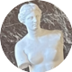{ width="50" }](#greco-romain) [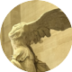{ width="50" }](#greco-romain)
  sub_title: 150 av. J-C
  title: Antiquité (Grèce)
  
- content: Louvetterie
  sub_title: 1'200
  title: Bas Moyen-Âge
  
- content: Saint-Sébastien   [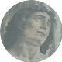{ width="50" }](#peinture)
  sub_title: 1'480
  title: Renaissance
  
- content: Noces de Cana (Véronèse) ; La Joconde (de Vinci)   [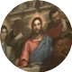{ width="50" }](#peinture) [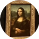{ width="50" }](#peinture)
  sub_title: 1'560
  title: Peinture (Italie)
  
- content: Louis XIV déménage à Versailles   [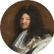{ width="50" }](#peinture)
  sub_title: 1'682
  title: Ancien Régime (Roi Soleil)
  
- content: Femme Voilée   [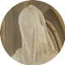{ width="50" }](#peinture)
  sub_title: 1'717
  title: Siècle des Lumières
  
- content: Peinture (France) avec Géricault, Delacroix...    [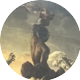{ width="50" }](#peinture) [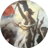{ width="50" }](#peinture) [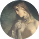{ width="50" }](#peinture) [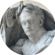{ width="50" }](#peinture) [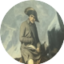{ width="50" }](#peinture) [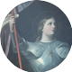{ width="50" }](#peinture)

  sub_title: 1'800 - 1'870
  title: Consulat au Second Empire
  

::/timeline::
