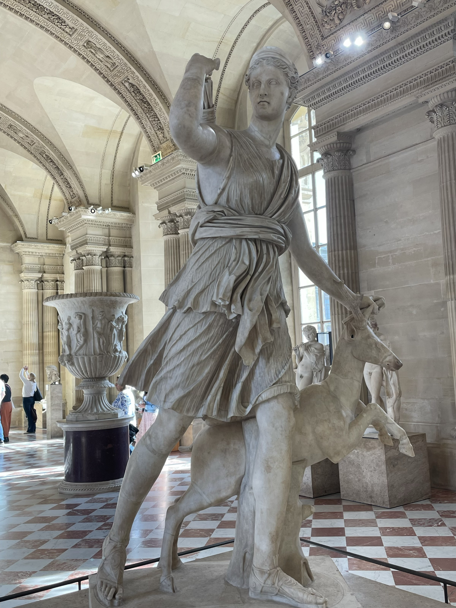
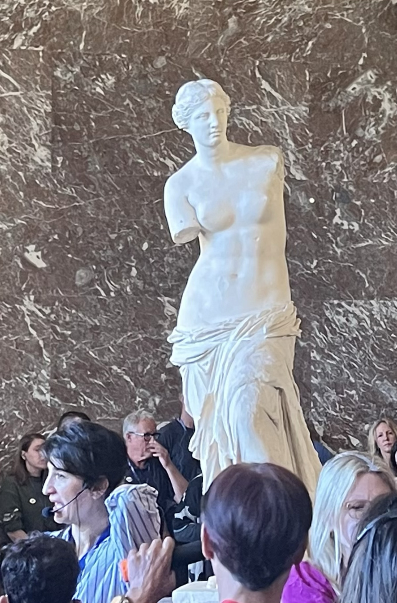

# Louvre Perspectives

Toujours en visite à Paris, nous nous plongeons dans une vision du monde multiverse. Le musée du Louvre est riche en superlatifs mais surtout héberge des trésors historiques provenant du monde entier et berce notre civilisation. 

- [x] Le plus grand des musées d'art : 10 terrains de foot!
- [x] Le plus visité : 9 à 10  millions de visiteurs par an!
- [x] Des chefs-d'oeuvre universels exposés dans un monument historique riche de 800 ans d'histoire.

<figure markdown>
{ width=60% }
<figcaption markdown> Buste d'Akhenaton </figcaption>
</figure>

<!-- more -->

## Le Louvre

### Louvre médiéval

A l'origine, le Louvre est en fait une Louvetterie qui protégait aussi vers l'ouest (direction Concorde et Arc de Triomphe). Il s'agissait aussi de chasser le loup et d'en récupérer les peaux et fourrures. Ce 1er chateau occupait environ 1/4 de la place carrée (cour intérieure). Des chaînes étaient aussi disposées le long de la Seine, c'est par là que les Vikings débarquaient et attaquaient. Nous sommes à la fin du XIIème siècle sous Philippe Auguste qui revient de croisade.

Dans les sous-sols du Louvre, on découvre donc les vestiges des douves, les pierres taillées portent les marquent des tâcherons, nécessaires pour se faire payer.

### Antiquités : Proche-Orient

Stèles et bas-reliefs. Ninive, l'Orient.
<figure markdown>
{ width=50% }
<figcaption markdown> Bas relief </figcaption>
</figure>

<figure markdown>
{ width=50% }
<figcaption markdown> Un air de Persépolis (palais de Darius) </figcaption>
</figure>

<figure markdown>
{ width=50% }
<figcaption markdown> Lion </figcaption>
</figure>

<figure markdown>
{ width=50% }
<figcaption markdown> Stèle </figcaption>
</figure>

<figure markdown>
{ width=50% }
<figcaption markdown> Lion </figcaption>
</figure>

<figure markdown>
{ width=50% }
<figcaption markdown> Je m'interroge... </figcaption>
</figure>

<figure markdown>
{ width=50% }
<figcaption markdown> J'aimerais tant déchiffrer! </figcaption>
</figure>

### Antiquités : Egypte

<figure markdown>
{ width=50% }
<figcaption markdown> Un Beau Sphinx : à l'inverse des Dieux, les Pharaons avaient le corps d'un animal et une tête humaine. On aperçoit les traces du Cobra sur la coiffe de tête. </figcaption>
</figure>

<figure markdown>
{ width=50% }
<figcaption markdown> Sarcophage </figcaption>
</figure>

<figure markdown>
{ width=50% }
<figcaption markdown> Gravure sur Tombeau </figcaption>
</figure>

<figure markdown>
{ width=50% }
<figcaption markdown> Momie </figcaption>
</figure>

### Antiquités : Grèce et Rome

Vénus de Milo, Victoire de Samothrace.

<figure markdown>
{ width=50% }
<figcaption markdown> Femme voilée </figcaption>
</figure>

<figure markdown>
{ width=50% }
<figcaption markdown> Diane Chasseresse </figcaption>
</figure>

<figure markdown>
{ width=50% }
<figcaption markdown> La Vénus de Milo : sculpture grecque et non une copie romaine. Le nez a été refait! Estimée du 2ème siècle av JC. </figcaption>
</figure>

<figure markdown>
{ width=50% }
<figcaption markdown> Victoire de Samothrace : ses ailes ont inspiré le logo de la marque Nike. </figcaption>
</figure>

### Peintures Italie et France

Joconde, Noces de Canaa, radeau, Liberté.

<figure markdown>
{ width=50% }
<figcaption markdown> Le Radeau de la Méduse (Géricault) </figcaption>
</figure>

<figure markdown>
{ width=50% }
<figcaption markdown> La Liberté </figcaption>
</figure>

<figure markdown>
{ width=50% }
<figcaption markdown> Jeanne d'Arc </figcaption>
</figure>

<figure markdown>
{ width=50% }
<figcaption markdown> La chasteté </figcaption>
</figure>

<figure markdown>
{ width=50% }
<figcaption markdown> Napoléon </figcaption>
</figure>

<figure markdown>
{ width=50% }
<figcaption markdown> Napoléon </figcaption>
</figure>

<figure markdown>
{ width=50% }
<figcaption markdown> Louis Le Grand (XIV) et la Quête du Temps! </figcaption>
</figure>

<figure markdown>
{ width=50% }
<figcaption markdown> Louis XIV </figcaption>
</figure>

<figure markdown>
{ width=50% }
<figcaption markdown> Les Egyptiens jouaient aussi ! </figcaption>
</figure>

<figure markdown>
{ width=50% }
<figcaption markdown> Galerie d'Appollon </figcaption>
</figure>

La **Galerie d'Apollon** (Louis XIV) constitue une  ébauche de la Galerie des Glaces car après 20 ans, le roi Soleil  déménagera au Chateau de Versailles. On peut y voir aussi les Joyaux de la Couronne, une collection initiée par François 1er qui utilise le trésor pour acheter un premier rubis :  le Côte de Bretagne. Autre pièce marquante : Le Régent, diamant d'une taille conséquente et réputé être le plus pur au monde (transparence exceptionnelle). Époque Louis XV (Philippe d’Orléans n’est pas le père mais le cousin du roi, il exerce le pouvoir en son nom pendant la minorité du jeune Louis XV.).

<figure markdown>
{ width=50% }
<figcaption markdown> HIV! </figcaption>
</figure>

<figure markdown>
{ width=50% }
<figcaption markdown> Un air bien triste... </figcaption>
</figure>

<figure markdown>
{ width=50% }
<figcaption markdown> Noces de Canaa </figcaption>
</figure>

<figure markdown>
{ width=50% }
<figcaption markdown> Mona Lisa et ses adorateurs </figcaption>
</figure>

<figure markdown>
{ width=50% }
<figcaption markdown> François 1er avait du nez ! </figcaption>
</figure>
