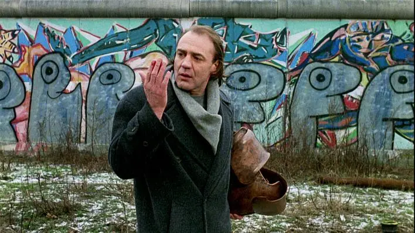

# Bienvenue sur mon blog personnel

J'ai décidé, après mon [aventure](https://divide.siroccomeister.net/) sur la Great Divide Mountain Bike Route, de continuer à écrire. J'ai donc créé ce nouvel espace en ligne pour faire exactement cela.

Quelques inspirations qui m'accompagnent sur le ton et l'esprit de mon blog :

- Dans le jeu de GO chinois/japonais, il existe une figure appelée [atari](https://en.wikipedia.org/wiki/List_of_Go_terms#Atari), un appel à l'action pour rester en vie. Cela mène essentiellement à une [échelle](https://en.wikipedia.org/wiki/Ladder_(Go)) que l'on continue de construire sous contrainte ou de (...) briser. J'aime le dynamisme que cela suggère et je trouve cela inspirant dans un monde qui tend à s'ignorer. J'ai pour but de progresser sur mon échelle et d'en briser les contraintes pour retrouver des degrés de liberté. Et vous ?
- [*Si loin, Si proche!*](https://en.wikipedia.org/wiki/Faraway,_So_Close!) est une autre citation d'un film de Wim Wenders. La suite du célèbre *Les Ailes du désir.* Bien que certaines de nos préoccupations et espoirs puissent sembler lointains, la vie est une opportunité que nous pouvons saisir ici et maintenant pour faire une différence. Et elle nourrit notre curiosité et notre envie d'explorer.

<figure markdown>
{ width="500px" }
<figcaption markdown>© Wim Wenders / Argos Films </figcaption>
</figure>

